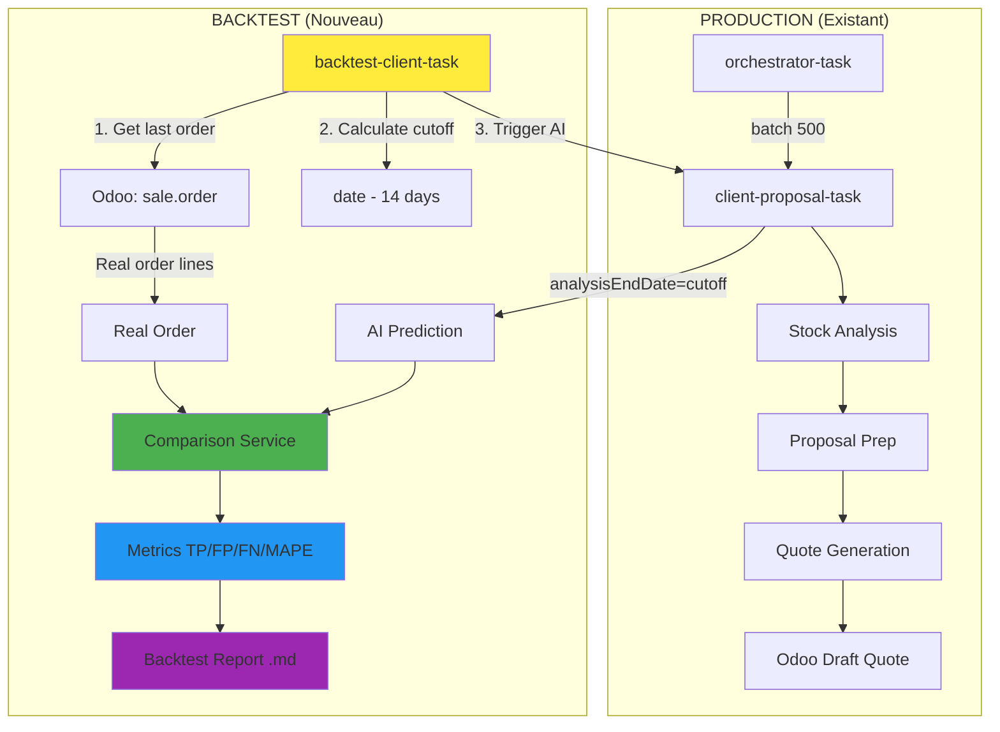

# Plan Backtest System - Architecture Complète

## 🎯 Objectif

Créer **1 task Trigger.dev** qui évalue la qualité des prédictions AI en comparant avec des commandes réelles historiques.

---

## 🏗️ Architecture Globale



---

## 📊 Flow Détaillé Backtest

### Entrée
```json
{
  "clientId": 60468,
  "daysBeforePrediction": 14  // Optionnel (défaut: 14)
}
```

### Étapes (6 phases)

**1️⃣ Récupération commande réelle**
- Appel: `odooClient.getOrderHistoryByPartner(clientId, 365, today)`
- Filtre: Prendre la dernière commande validée (`state: 'sale' | 'done'`)
- Output: `{ id, name, date_order, partner_name }`

**2️⃣ Calcul date de cutoff**
- Formule: `cutoffDate = date_order - daysBeforePrediction`
- Exemple: Si commande le 04/11/2025 → cutoff = 21/10/2025
- Cette date simule "l'état du monde" X jours avant la commande réelle

**3️⃣ Lancer prédiction AI**
```typescript
const aiResult = await clientProposalTask.triggerAndWait({
  client: { id, name },
  config: {
    analysisEndDate: cutoffDate,  // ← KEY: Time travel
    skipOdooQuoteGeneration: true,
    shouldGenerateReport: false
  }
});
```
- Reçoit: `ProposalPreparationResult` avec liste de produits prédits + quantités

**4️⃣ Récupération détails commande réelle**
```typescript
const realOrder = await odooClient.getSaleOrderDetails(order.id);
// Retourne: { order: {...}, lines: [{product_id, qty, ...}] }
```

**5️⃣ Comparaison & Métriques**
- Input: AI products vs Real order lines
- Processing: Calcul TP/FP/FN + MAPE + Distribution exact/partial/wrong
- Output: `BacktestComparisonResult`

**6️⃣ Génération rapport**
- Markdown détaillé sauvegardé dans `/reports-output/backtest-client-{id}-{orderName}.md`
- Contient: métriques, tableaux produits, analyse erreurs

---

## 🗂️ Composants à Créer

### 1. **Task Trigger.dev**
📁 `backend/src/trigger/backtest-client.task.ts`
- Orchestration du flow complet
- Appelle services + tasks existantes
- Gère les erreurs et timeouts

### 2. **Service Comparaison**
📁 `backend/src/features/backtesting/comparison.service.ts`

**Fonctions principales:**
- `compareAIPredictionVsRealOrder()` → Calcul TP/FP/FN
- `calculateProductMetrics()` → Precision/Recall/F1
- `calculateQuantityMetrics()` → MAPE + distribution
- `classifyQuantityMatch()` → Exact/Partial/Wrong (seuils: 10%, 50%)

### 3. **Service Odoo Helper**
📁 `backend/src/infrastructure/odoo/odoo.service.ts` (ajout fonction)

**Nouvelle fonction:**
- `getLastClientOrder(clientId)` → Wrapper qui retourne dernière commande validée

### 4. **Générateur Rapport**
📁 `backend/src/reports/backtest-report.ts`

**Output:** Markdown structuré avec:
- Contexte (client, dates, config)
- Métriques globales (tableaux)
- Détail par produit (TP/FP/FN avec justifications)
- Recommandations (analyse erreurs récurrentes)

### 5. **Types TypeScript**
📁 `backend/src/features/backtesting/backtest.types.ts`

**Interfaces principales:**
- `BacktestComparisonResult` (structure complète résultat)
- `ProductMatch` (TP avec erreur quantité)
- `ProductMismatch` (FP/FN avec justification)
- `ProductMetrics` (precision/recall/f1)
- `QuantityMetrics` (mape + distribution)

### 6. **Route HTTP** (optionnel)
📁 `backend/src/index.ts` (ajout route)
- POST `/api/backtest-client`
- Permet lancement manuel via curl/Postman

---

## 📐 Comparaison Flow Normal vs Backtest

| Aspect | Production (Normal) | Backtest (Evaluation) |
|--------|---------------------|----------------------|
| **Trigger** | Orchestrator → Tous clients inactifs | Manuel → 1 client spécifique |
| **Date Analysis** | `analysisEndDate = today` | `analysisEndDate = orderDate - 14j` |
| **Odoo Quotes** | ✅ Création devis draft | ❌ Skip (`skipQuoteGeneration: true`) |
| **Output** | Devis Odoo + Rapport client | Rapport comparaison AI vs Réel |
| **Objectif** | Générer propositions commerciales | Évaluer performance système |

---

## 🎲 Cas d'Usage

### Cas 1: Test Manuel Client S40009
```bash
curl -X POST http://localhost:3000/api/backtest-client \
  -H "Content-Type: application/json" \
  -d '{"clientId": 60468, "daysBeforePrediction": 14}'
```

**Résultat attendu:**
- Commande réelle: S40009 du 04/11/2025
- Cutoff AI: 21/10/2025
- Rapport: `/reports-output/backtest-client-60468-S40009.md`
- Métriques visibles dans le rapport

### Cas 2: Batch Evaluation (future extension)
```typescript
// Orchestrator backtest (à créer plus tard)
const testClients = [60468, 60264, 29303];
for (const clientId of testClients) {
  await backtestClientTask.triggerAndWait({ clientId });
}
```

### Cas 3: Configuration Optimization
```typescript
// Tester différents seuils
for (const threshold of [14, 19, 30]) {
  await backtestClientTask.triggerAndWait({
    clientId: 60468,
    config: { targetCoverage: threshold }
  });
}
```

---

## 📊 Métriques Calculées

### Niveau 1: Détection Produit (Binaire)

**True Positives (TP):**
- Produit que AI prédit **ET** client commande
- Exemple: AI dit "JOY02" → Client commande "JOY02" ✅

**False Positives (FP):**
- Produit que AI prédit **MAIS** client ne commande pas
- Exemple: AI dit "REB01" → Client ne commande rien ❌

**False Negatives (FN):**
- Produit que client commande **MAIS** AI ne prédit pas
- Exemple: Client commande "LV160" → AI n'avait rien dit 😞

**Métriques dérivées:**
- **Precision** = TP / (TP + FP) → "Sur 100 prédictions AI, combien sont correctes?"
- **Recall** = TP / (TP + FN) → "Sur 100 commandes réelles, combien AI détecte?"
- **F1-Score** = 2 × (P × R) / (P + R) → "Score équilibré global"

### Niveau 2: Précision Quantité (Continue)

**MAPE (Mean Absolute Percentage Error):**
- Formule: `Moyenne( |Qté_AI - Qté_Réel| / Qté_Réel × 100% )`
- Exemple: AI dit 4, Réel 2 → Erreur = 100%

**Distribution (seuils configurables):**
- **Exact Match**: Erreur ≤ 10% (quantité quasi-parfaite)
- **Partial Match**: 10% < Erreur ≤ 50% (ordre de grandeur correct)
- **Wrong Match**: Erreur > 50% (quantité très fausse)

---

## 🚀 Plan d'Implémentation

### Phase 1: Fondations (Types + Comparaison)
1. Créer `backtest.types.ts` avec toutes les interfaces
2. Créer `comparison.service.ts` avec logique TP/FP/FN/MAPE
3. Ajouter tests unitaires pour la comparaison

### Phase 2: Intégration Odoo
4. Ajouter helper `getLastClientOrder()` dans `odoo.service.ts`
5. Tester récupération commandes sur clients réels

### Phase 3: Rapport & Task
6. Créer `backtest-report.ts` (génération markdown)
7. Créer `backtest-client.task.ts` (orchestration)
8. Tester flow complet sur S40009

### Phase 4: HTTP & Validation
9. Ajouter route `/api/backtest-client` (optionnel)
10. Valider sur 3-5 clients différents
11. Ajuster seuils si nécessaire

---

## ✅ Validation Finale

**Critères de succès:**
- ✅ Task `backtest-client` exécutable via Trigger.dev dashboard
- ✅ Rapport markdown généré avec métriques complètes
- ✅ Comparaison cohérente avec notes manuelles (S40009, S39837)
- ✅ Aucune dépendance externe (réutilise infra existante)
- ✅ Temps d'exécution < 30s par client

---

## 📋 Checklist Implémentation

- [ ] `backend/src/features/backtesting/backtest.types.ts`
- [ ] `backend/src/features/backtesting/comparison.service.ts`
- [ ] `backend/src/infrastructure/odoo/odoo.service.ts` (helper)
- [ ] `backend/src/reports/backtest-report.ts`
- [ ] `backend/src/trigger/backtest-client.task.ts`
- [ ] `backend/src/index.ts` (route HTTP)
- [ ] Test sur client S40009 (LES SORBIERS)
- [ ] Test sur client S39837 (CINEMA GALERIES)
- [ ] Validation métriques vs analyse manuelle
