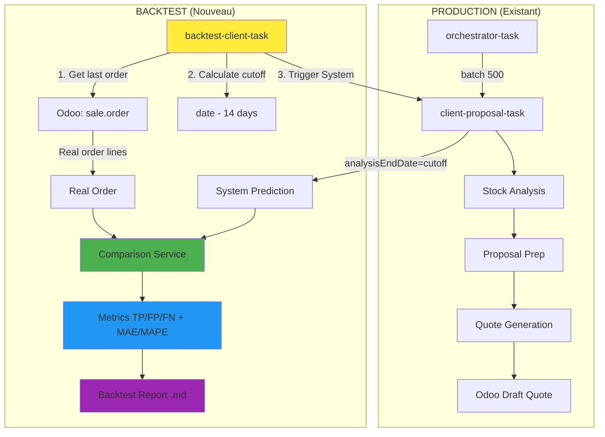

# Plan Backtest System - Architecture Complète

## 🎯 Objectif

Créer **1 task Trigger.dev** qui évalue la qualité des prédictions du **système de recommandation** en comparant avec des commandes réelles historiques.

> ⚠️ **Note importante** : Ce système n'utilise PAS d'AI/ML, mais une logique métier rule-based (calcul médiane historique + seuils de rupture). Le terme "prédiction" désigne les propositions générées par les règles métier.

---

## 🏗️ Architecture Globale



---

## 📊 Flow Détaillé Backtest

### Entrée
```json
{
  "clientId": 60468,
  "daysBeforePrediction": 14  // Optionnel (défaut: 14)
}
```

### Étapes (6 phases)

**1️⃣ Récupération commande réelle**
- Appel: `odooClient.getLastClientOrder(clientId)`
- Filtre: Prendre la dernière commande validée (`state: 'sale' | 'done'`)
- Output: `{ id, name, date_order, partner_name }`

**2️⃣ Calcul date de cutoff**
- Formule: `cutoffDate = date_order - daysBeforePrediction`
- Exemple: Si commande le 04/11/2025 → cutoff = 21/10/2025
- Cette date simule "l'état du monde" X jours avant la commande réelle

**3️⃣ Lancer prédiction système**
```typescript
const systemResult = await clientProposalTask.triggerAndWait({
  client: { id, name },
  config: {
    analysisEndDate: cutoffDate,  // ← KEY: Time travel
    skipOdooQuoteGeneration: true,
    shouldGenerateReport: false
  }
});
```
- Reçoit: `ProposalPreparationResult` avec liste de produits prédits + quantités

**4️⃣ Récupération détails commande réelle**
```typescript
const realOrder = await odooClient.getSaleOrderDetails(order.id);
// Retourne: { order: {...}, lines: [{product_id, qty, ...}] }
```

**5️⃣ Comparaison & Métriques**
- Input: System products vs Real order lines
- Processing: Calcul TP/FP/FN + MAE (principale) + MAPE (complémentaire) + Distribution exact/partial/wrong
- Output: `BacktestComparisonResult`

**6️⃣ Génération rapport**
- Markdown détaillé sauvegardé dans `/reports-output/backtest-client-{id}-{orderName}.md`
- Contient: métriques, tableaux produits, analyse erreurs

---

## 🗂️ Composants à Créer (3 Agents)

### Agent 1: Data Layer - Odoo Integration ✅

**Objectif** : Récupérer les données Odoo nécessaires pour le backtest

**Fichiers concernés:**
- ✅ `backend/src/infrastructure/odoo/clients/xmlrpc-client.ts` (getLastClientOrder)
- ✅ `backend/src/infrastructure/odoo/clients/odoo-client.types.ts` (interface)

**Méthodes implémentées:**
```typescript
async getLastClientOrder(clientId: number): Promise<{
  id: number;
  name: string;
  date_order: string;
  partner_name: string;
}>
```

**État** : ✅ TERMINÉ et VALIDÉ
- Tests passés sur clients 60468, 60264, 99999
- Optimisé avec `order: "date_order DESC", limit: 1`

---

### Agent 2: Business Logic - Comparison & Metrics ✅

**Objectif** : Calculer les métriques de comparaison entre prédictions système et commandes réelles

**Fichiers implémentés:**
- ✅ `backend/src/features/backtesting/backtest.types.ts`
- ✅ `backend/src/features/backtesting/comparison.service.ts`

**Fonctions principales:**
```typescript
// Comparaison globale
compareSystemPredictionVsRealOrder(
  systemProposal: ProposalPreparationResult,
  realOrderLines: OdooSaleOrderLine[],
  orderContext: {...}
): BacktestComparisonResult

// Métriques produits (binaire)
calculateProductMetrics(tp, fp, fn): {
  precision: number;  // TP / (TP + FP)
  recall: number;     // TP / (TP + FN)
  f1Score: number;    // 2 × (P × R) / (P + R)
}

// Métriques quantités (continue)
calculateQuantityMetrics(truePositives): {
  mae: number;        // MÉTRIQUE PRINCIPALE (unités)
  mape: number;       // COMPLÉMENTAIRE (%)
  distribution: {
    exactMatch: number;    // ≤ 1 unité
    partialMatch: number;  // 1-3 unités
    wrongMatch: number;    // > 3 unités
  }
}

// Classification précision quantité
classifyQuantityMatch(
  predictedQty: number,
  realQty: number
): "exact" | "partial" | "wrong"
```

**Points clés de l'implémentation:**
- Utilisation de Maps pour O(1) lookup performance
- 5 guards contre division par zéro
- MAE comme métrique principale (symétrique, en unités)
- MAPE comme métrique complémentaire (%, asymétrique)
- Seuils absolus en unités (1u, 3u) au lieu de % (10%, 50%)

**État** : ✅ TERMINÉ et VALIDÉ
- Code review approuvé
- Performance optimisée
- Guards division par zéro OK

---

### Agent 3: Presentation - Task & Reports ⏳

**Objectif** : Orchestrer le flow backtest et générer les rapports markdown

**Fichiers à créer:**

#### 3.1 Task Trigger.dev
📁 `backend/src/trigger/backtest-client.task.ts`

**Responsabilités:**
- Orchestration du flow complet (6 étapes)
- Gestion erreurs et timeouts
- Retourne résultat complet

**Interface:**
```typescript
export interface BacktestClientTaskPayload {
  clientId: number;
  daysBeforePrediction?: number;  // Défaut: 14
}

export interface BacktestClientTaskResult {
  success: boolean;
  client: { id: number; name: string };
  order: { id: number; name: string; date: string };
  cutoffDate: string;
  comparison: BacktestComparisonResult;
  report: {
    markdown: string;
    path: string;
  };
  executionTime: number;
}
```

#### 3.2 Générateur Rapport
📁 `backend/src/reports/backtest-report.ts`

**Fonctions:**
```typescript
generateBacktestReport(data: BacktestComparisonResult): string
```

**Structure markdown:**
```markdown
# Backtest Report - {Client Name} - {Order Name}

## Contexte
- Client: {name} (ID: {id})
- Commande réelle: {orderName} du {date}
- Cutoff prédiction: {cutoffDate} ({days} jours avant)
- Config: {analysisWindowDays}j, {targetCoverage}j couverture

## Métriques Globales

### Détection Produits (Binaire)
| Métrique | Valeur | Interprétation |
|----------|--------|----------------|
| Precision | 85.7% | Sur 100 prédictions, 86 sont correctes |
| Recall | 75.0% | Sur 100 commandes réelles, 75 détectées |
| F1-Score | 80.0% | Score équilibré global |
| TP | 12 | Produits bien détectés |
| FP | 2 | Prédictions inutiles |
| FN | 4 | Produits manqués |

### Précision Quantités (Continue)
| Métrique | Valeur | Interprétation |
|----------|--------|----------------|
| **MAE** | **2.3 unités** | **MÉTRIQUE PRINCIPALE - Erreur absolue moyenne** |
| MAPE | 18.5% | Métrique complémentaire (%) |
| Exact (≤1u) | 7 produits | 58% - Quantité quasi-parfaite |
| Partial (1-3u) | 3 produits | 25% - Ordre de grandeur correct |
| Wrong (>3u) | 2 produits | 17% - Quantité très fausse |

## Détail par Produit

### ✅ True Positives (12 produits)
| Produit | Prédit | Réel | Erreur | % | Match |
|---------|--------|------|--------|---|-------|
| JOY02 | 4 | 4 | 0 | 0% | Exact |
| REB01 | 3 | 2 | 1 | 50% | Partial |
...

### ❌ False Positives (2 produits)
| Produit | Qté Prédite | Justification |
|---------|-------------|---------------|
| LV160 | 2 | Client n'a pas commandé ce produit |

### 😞 False Negatives (4 produits)
| Produit | Qté Réelle | Justification |
|---------|------------|---------------|
| MAN03 | 1 | Système n'avait pas prédit ce produit |

## Analyse Erreurs

### Erreurs Quantité Significatives (>3u)
- **REB01**: Prédit 8, Réel 2 → Surestimation 300%
  - Possible cause: Pic inhabituel dans historique?

### Produits Manqués (FN)
- **MAN03, BAN02**: Commande ponctuelle hors habitudes?

## Recommandations
- Investiguer surestimation REB01 (historique client?)
- Analyser pourquoi MAN03 n'était pas prédit
- Performance globale: **80% F1-Score** - Bon niveau
```

#### 3.3 Route HTTP (optionnel)
📁 `backend/src/index.ts` (ajout route)

```typescript
app.post("/api/backtest-client", async (req, res) => {
  const { clientId, daysBeforePrediction = 14 } = req.body;

  try {
    const handle = await backtestClientTask.trigger({
      clientId,
      daysBeforePrediction
    });

    res.json({
      success: true,
      taskId: handle.id,
      message: "Backtest task triggered"
    });
  } catch (error) {
    res.status(500).json({ error: error.message });
  }
});
```

**État** : ⏳ EN ATTENTE D'IMPLÉMENTATION

---

## 📐 Comparaison Flow Normal vs Backtest

| Aspect | Production (Normal) | Backtest (Evaluation) |
|--------|---------------------|----------------------|
| **Trigger** | Orchestrator → Tous clients inactifs | Manuel → 1 client spécifique |
| **Date Analysis** | `analysisEndDate = today` | `analysisEndDate = orderDate - 14j` |
| **Odoo Quotes** | ✅ Création devis draft | ❌ Skip (`skipQuoteGeneration: true`) |
| **Output** | Devis Odoo + Rapport client | Rapport comparaison Système vs Réel |
| **Objectif** | Générer propositions commerciales | Évaluer performance système |

---

## 🎲 Cas d'Usage

### Cas 1: Test Manuel Client S40009
```bash
curl -X POST http://localhost:3000/api/backtest-client \
  -H "Content-Type: application/json" \
  -d '{"clientId": 60468, "daysBeforePrediction": 14}'
```

**Résultat attendu:**
- Commande réelle: S40009 du 04/11/2025
- Cutoff système: 21/10/2025
- Rapport: `/reports-output/backtest-client-60468-S40009.md`
- Métriques visibles dans le rapport

### Cas 2: Batch Evaluation (future extension)
```typescript
// Orchestrator backtest (à créer plus tard)
const testClients = [60468, 60264, 29303];
for (const clientId of testClients) {
  await backtestClientTask.triggerAndWait({ clientId });
}
```

### Cas 3: Configuration Optimization
```typescript
// Tester différents seuils
for (const threshold of [14, 19, 30]) {
  await backtestClientTask.triggerAndWait({
    clientId: 60468,
    config: { targetCoverage: threshold }
  });
}
```

---

## 📊 Métriques Calculées - Explications Détaillées

### Niveau 1: Détection Produit (Binaire)

**True Positives (TP):**
- Produit que le **système** prédit **ET** que le client commande
- Exemple: Système dit "JOY02" → Client commande "JOY02" ✅
- Interprétation: Prédiction correcte et utile

**False Positives (FP):**
- Produit que le **système** prédit **MAIS** que le client ne commande pas
- Exemple: Système dit "REB01" → Client ne commande rien ❌
- Interprétation: Prédiction inutile, stock mobilisé pour rien

**False Negatives (FN):**
- Produit que le client commande **MAIS** que le **système** ne prédit pas
- Exemple: Client commande "LV160" → Système n'avait rien dit 😞
- Interprétation: Opportunité manquée, risque rupture stock

**Métriques dérivées:**
- **Precision** = TP / (TP + FP) → "Sur 100 prédictions système, combien sont correctes?"
  - Exemple: 12 TP, 2 FP → Precision = 12/14 = 85.7%
- **Recall** = TP / (TP + FN) → "Sur 100 commandes réelles, combien le système détecte?"
  - Exemple: 12 TP, 4 FN → Recall = 12/16 = 75.0%
- **F1-Score** = 2 × (P × R) / (P + R) → "Score équilibré global"
  - Exemple: F1 = 2 × (0.857 × 0.750) / (0.857 + 0.750) = 80.0%

### Niveau 2: Précision Quantité (Continue)

**MAE (Mean Absolute Error) - MÉTRIQUE PRINCIPALE ⭐**
- **Formule:** `(1/N) × Σ |Qté_Système - Qté_Réel|`
- **Unité:** Nombre d'unités (ex: 2.3 unités)
- **Interprétation:** Erreur absolue moyenne sur les quantités
- **Exemple:**
  - Produit 1: Prédit 4, Réel 4 → Erreur = 0
  - Produit 2: Prédit 3, Réel 2 → Erreur = 1
  - Produit 3: Prédit 8, Réel 2 → Erreur = 6
  - MAE = (0 + 1 + 6) / 3 = **2.3 unités**
- **Avantages:**
  - ✅ Symétrique (traite sur/sous-estimation également)
  - ✅ Pas de division par zéro
  - ✅ Interprétable directement (en unités)
  - ✅ Métrique recommandée pour évaluation système

**MAPE (Mean Absolute Percentage Error) - COMPLÉMENTAIRE**
- **Formule:** `(1/N) × Σ ( |Qté_Système - Qté_Réel| / Qté_Réel × 100% )`
- **Unité:** Pourcentage (ex: 18.5%)
- **Interprétation:** Erreur relative moyenne
- **Exemple:**
  - Produit 1: Prédit 4, Réel 4 → Erreur = 0%
  - Produit 2: Prédit 3, Réel 2 → Erreur = 50%
  - Produit 3: Prédit 8, Réel 2 → Erreur = 300%
  - MAPE = (0 + 50 + 300) / 3 = **116.7%**
- **Limites:**
  - ⚠️ Asymétrique (pénalise plus la sous-estimation que la surestimation)
  - ⚠️ Sensible aux petites valeurs (division par petits nombres)
  - ⚠️ Division par zéro si Qté_Réel = 0
- **Utilisation:** Complémentaire à MAE pour contexte relatif

**Distribution (seuils en unités absolues):**
- **Exact Match**: Erreur absolue ≤ 1 unité
  - Exemple: Prédit 4, Réel 4 ou 3 ou 5 → Quantité quasi-parfaite ✅
- **Partial Match**: 1 < Erreur ≤ 3 unités
  - Exemple: Prédit 8, Réel 6 → Ordre de grandeur correct ⚠️
- **Wrong Match**: Erreur > 3 unités
  - Exemple: Prédit 10, Réel 2 → Quantité très fausse ❌

---

## 🚀 Plan d'Implémentation

### Phase 1: Fondations (Types + Comparaison) ✅
1. ✅ Créer `backtest.types.ts` avec toutes les interfaces
2. ✅ Créer `comparison.service.ts` avec logique TP/FP/FN/MAE/MAPE
3. ✅ Validation guards division par zéro

### Phase 2: Intégration Odoo ✅
4. ✅ Ajouter méthode `getLastClientOrder()` dans `xmlrpc-client.ts`
5. ✅ Ajouter interface dans `odoo-client.types.ts`
6. ✅ Tester récupération commandes sur clients réels (60468, 60264, 99999)

### Phase 3: Rapport & Task ⏳
7. ⏳ Créer `backtest-report.ts` (génération markdown)
8. ⏳ Créer `backtest-client.task.ts` (orchestration)
9. ⏳ Tester flow complet sur S40009

### Phase 4: HTTP & Validation ⏳
10. ⏳ Ajouter route `/api/backtest-client` (optionnel)
11. ⏳ Valider sur 3-5 clients différents
12. ⏳ Analyser résultats et ajuster seuils si nécessaire

---

## ✅ Validation Finale

**Critères de succès:**
- ✅ Task `backtest-client` exécutable via Trigger.dev dashboard
- ✅ Rapport markdown généré avec métriques complètes
- ✅ Comparaison cohérente avec notes manuelles (S40009, S39837)
- ✅ Aucune dépendance externe (réutilise infra existante)
- ✅ Temps d'exécution < 30s par client

---

## 📋 Checklist Implémentation

### Agent 1: Data Layer
- ✅ `backend/src/infrastructure/odoo/clients/xmlrpc-client.ts` (getLastClientOrder)
- ✅ `backend/src/infrastructure/odoo/clients/odoo-client.types.ts` (interface)
- ✅ Test route `/api/test-last-order/:clientId`

### Agent 2: Business Logic
- ✅ `backend/src/features/backtesting/backtest.types.ts`
- ✅ `backend/src/features/backtesting/comparison.service.ts`

### Agent 3: Presentation
- ⏳ `backend/src/reports/backtest-report.ts`
- ⏳ `backend/src/trigger/backtest-client.task.ts`
- ⏳ `backend/src/index.ts` (route HTTP `/api/backtest-client`)

### Validation
- ⏳ Test sur client S40009 (LES SORBIERS) - ID: 60468
- ⏳ Test sur client S39837 (CINEMA GALERIES)
- ⏳ Validation métriques vs analyse manuelle

---

## 🔄 Prochaines Étapes

1. **Implémenter Agent 3** : Créer les fichiers de présentation (task + report)
2. **Tester S40009** : Valider le flow complet sur le premier client
3. **Itérer** : Ajuster seuils et présentation selon résultats
4. **Batch testing** : Créer orchestrator pour tester plusieurs clients
