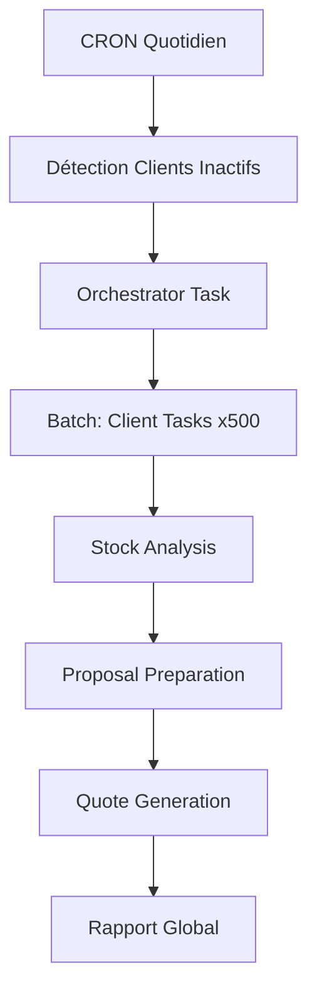

# 📋 Plan Complet de Documentation "Hub and Spoke"

## 🎯 Objectif Global

Transformer la documentation complexe actuelle en structure claire **"Hub and Spoke"** :
- **Hub** (README.md principal) : 100% accessible aux non-techniques
- **Spokes** (9 sous-docs) : Détails techniques pour développeurs

---

## ⚠️ RÈGLE CRITIQUE

**Chaque agent DOIT** :
1. **RE-ANALYSER le code source actuel** (Glob + Read des fichiers .ts)
2. **VÉRIFIER** que le comportement décrit correspond au code réel
3. **NE PAS** se baser uniquement sur les anciennes docs (code a changé avec refactoring dateMin/dateMax)
4. **VALIDER** la cohérence entre documentation et implémentation

---

## 📐 Structure Homogène pour TOUS les Spokes

```markdown
# [Nom du Module]

## 🎯 Rôle
[1 phrase décrivant sa responsabilité]

## 📦 Inventaire des Composants

### Fichier: `nom-fichier.ts`
**Description:** [Ce qu'il fait en 1 phrase]

<details><summary>Voir l'implémentation</summary>

```typescript
// Extrait de code pertinent (10-30 lignes max)
```

</details>

## 🔧 Guides Pratiques

<details><summary>Comment ajouter/modifier X ?</summary>

1. Étape 1
2. Étape 2
3. ...

</details>

<details><summary>Points de vigilance / Dépendances</summary>

- Dépendance externe Y
- Configuration requise Z
- ...

</details>

## 🔗 Références
- Lien vers autres modules liés
- Documentation externe
```

---

## 🤖 Division en Agents (Exécution Parallèle)

### Agent 0: Hub Principal
**Fichier:** `/README.md` (racine)

**Responsabilités:**
1. Analyser le flow global du système (orchestrator.task.ts + client-proposal.task.ts)
2. Créer une description **1 phrase** accessible aux non-techniques
3. Créer un diagramme Mermaid `graph TD` du flux complet (5 phases)
4. Lister les 9 dossiers clés avec liens vers Spokes
5. Ajouter guide de démarrage rapide dans `<details>`

**Contenu attendu:**
```markdown
# Auto-Proposal System

## Finalité
Génère automatiquement des propositions de commande pour les clients inactifs en analysant leur historique et en détectant les ruptures de stock imminentes.

## Le Flux Principal

1. **Détection** : Un CRON quotidien identifie les clients inactifs (sans commande depuis 30 jours)
2. **Analyse** : Pour chaque client, calcul de la consommation/jour et prédiction rupture stock
3. **Quantité** : Calcul quantité à commander (médiane historique sur 6 mois)
4. **Proposition** : Enrichissement avec prix + ajustement MOQ (300€ minimum)
5. **Devis** : Création automatique du devis draft dans Odoo



## Architecture

| Module | Rôle | Documentation |
|--------|------|---------------|
| `/trigger/` | Orchestration Trigger.dev (batch processing) | 📖 [Détails techniques](backend/src/trigger/README.md) |
| `/features/client-inactivity/` | Phase 0: Détection clients inactifs | 📖 [Détails](backend/src/features/client-inactivity/README.md) |
| ... | ... | ... |

<details><summary>🚀 Démarrage Rapide</summary>

```bash
# Installation
pnpm install

# Démarrer le backend API
pnpm dev

# Démarrer Trigger.dev (dev mode)
pnpm trigger:dev

# Variables d'environnement requises
# .env
ODOO_URL=...
ODOO_DB=...
ODOO_USERNAME=...
ODOO_PASSWORD=...
TRIGGER_SECRET_KEY=...
```

</details>
```

---

### Agent 1: Trigger.dev Orchestration
**Fichier:** `/backend/src/trigger/README.md` ✨ NOUVEAU

**Analyse requise:**
- Lire `orchestrator.task.ts` ligne par ligne
- Lire `client-proposal.task.ts` ligne par ligne
- Identifier BATCH_SIZE = 500, retry logic, error handling
- Vérifier les configs utilisées (dateMin/dateMax, analysisEndDate)

**Contenu attendu:**
- Rôle: Orchestration via Trigger.dev v3 (batch processing de 500 clients en parallèle)
- Inventaire:
  - `orchestrator.task.ts`: Task principale (détection → batch trigger → rapports)
  - `client-proposal.task.ts`: Task par client (3 phases: stock → pricing → quote)
  - `index.ts`: Export des tasks
- Guides pratiques:
  - Comment ajouter une nouvelle task?
  - Modifier la taille des batchs (BATCH_SIZE)
  - Configurer les retries
  - Gérer les erreurs batch
- Points de vigilance:
  - Limite Trigger.dev: 500 tasks/batch max
  - triggerAndWait retourne Result{ok, output, error}, pas l'output direct
  - Jamais utiliser Promise.all avec triggerAndWait

---

### Agent 2: Client Inactivity Detection
**Fichier:** `/backend/src/features/client-inactivity/README.md` ✨ NOUVEAU

**Analyse requise:**
- Lire `inactivity.service.ts`
- Lire `transform.utils.ts`
- Vérifier l'utilisation de dateMin/dateMax (APRÈS refactoring)
- Identifier le filtrage par tag Odoo (excludeTagId)

**Contenu attendu:**
- Rôle: Phase 0 - Détection des clients inactifs via Odoo XML-RPC
- Inventaire:
  - `inactivity.service.ts`: `getInactiveClients(dateMin, dateMax, excludeTagId?)`
  - `transform.utils.ts`: Transformation des données Odoo en `InactiveClient[]`
- Guides pratiques:
  - Modifier la période d'inactivité (dateMin/dateMax)
  - Filtrer les clients avec tag "Auto-proposal" (excludeTagId: 82)
  - Ajouter des critères de filtrage supplémentaires
- Points de vigilance:
  - Utilise buildRecentOrdersDomain() avec dateMin ET dateMax
  - Le format date est "YYYY-MM-DD HH:MM:SS"
  - excludeTagId est optionnel (undefined = inclut tous les clients)

---

### Agent 3: Stock Replenishment Analysis
**Fichier:** `/backend/src/features/stock-replenishment/README.md` ♻️ ADAPTER

**Analyse requise:**
- Lire `stock-replenishment.service.ts`
- Lire tous les fichiers dans `order-history/`, `utils/`
- Vérifier l'utilisation de analysisEndDate (APRÈS refactoring)
- Identifier la stratégie médiane actuelle (5 niveaux? 4 niveaux?)

**Contenu attendu:**
- Restructurer la doc existante selon le template standard
- Mettre les extraits de code dans `<details>`
- Simplifier le flux avec diagramme Mermaid
- Inventaire:
  - `stock-replenishment.service.ts`: Orchestrateur Phase 1 & 2
  - `order-history/order-history.service.ts`: Récupération historique Odoo
  - `utils/consumption.utils.ts`: Calcul consommation/jour
  - `utils/prediction.utils.ts`: Prédiction rupture stock
  - `utils/quantity.utils.ts`: Calcul quantité (médiane)
  - `utils/median.utils.ts`: Fonction médiane
- Guides pratiques:
  - Modifier la fenêtre d'analyse (analysisWindowDays)
  - Changer la stratégie de quantité (médiane → moyenne?)
  - Ajuster le seuil de rupture (targetCoverage + leadTime)
- Points de vigilance:
  - analysisEndDate permet l'analyse rétroactive
  - Stratégie médiane à 4 niveaux (0, 1, 2-4, 5+)
  - UoM déjà dans le bon format (pas de conversion)

---

### Agent 4: Proposal Preparation
**Fichier:** `/backend/src/features/proposal-preparation/README.md` ♻️ ADAPTER

**Analyse requise:**
- Lire `proposal-preparation.service.ts`
- Lire `pricing/pricing.service.ts`
- Lire `moq/moq-adjustment.service.ts`
- Vérifier le mode de pricing actuel (historyPriceForClient)
- Analyser l'algorithme MOQ round-robin

**Contenu attendu:**
- Restructurer selon template
- Mettre UoM, pricing modes, algorithme MOQ dans `<details>`
- Ajouter diagramme Mermaid du flow
- Inventaire:
  - `proposal-preparation.service.ts`: Orchestrateur Phase 2.5
  - `pricing/pricing.service.ts`: Enrichissement prix
  - `moq/moq-adjustment.service.ts`: Ajustement MOQ (round-robin)
  - `moq/adjustment-strategy.utils.ts`: Tri des produits (fréquence + confiance)
- Guides pratiques:
  - Modifier le MOQ minimum (300€)
  - Changer l'algorithme d'ajustement (round-robin → autre?)
  - Implémenter currentPriceForClient (module custom Odoo)
- Points de vigilance:
  - Mode historyPriceForClient a des limitations (paliers obsolètes)
  - Algorithme round-robin s'arrête dès que gap comblé
  - Tri par order_count DESC puis confidence

---

### Agent 5: Quote Generation
**Fichier:** `/backend/src/features/proposal-generation/README.md` ✨ NOUVEAU

**Analyse requise:**
- Lire `proposal-generation.service.ts`
- Identifier les appels XML-RPC (create, write)
- Vérifier le tag Auto-proposal (ID: 82)
- Analyser la structure sale.order + sale.order.line

**Contenu attendu:**
- Rôle: Phase 3 - Création devis draft dans Odoo via XML-RPC
- Inventaire:
  - `proposal-generation.service.ts`: `generateQuote(proposal, odooClient)`
  - Création sale.order (header)
  - Création sale.order.line[] (lignes)
  - Application du tag 82 (Auto-proposal)
- Guides pratiques:
  - Créer un devis manuellement
  - Ajouter des lignes de commande
  - Modifier le tag Odoo (autre que 82)
  - Récupérer le PDF du devis
- Points de vigilance:
  - Utilise xmlrpc-client (pas json2-client)
  - Tag ID 82 doit exister dans Odoo
  - Devis en mode "draft" (pas envoyé auto)

---

### Agent 6: Email Sending
**Fichier:** `/backend/src/features/email-sending/README.md` ✨ NOUVEAU

**Analyse requise:**
- Lire `email-sending.service.ts`
- Identifier si implémenté ou stub
- Chercher mail.template API calls
- Vérifier scripts dans `/scripts/` (test-email-send.ts, check-email-status.ts)

**Contenu attendu:**
- Rôle: Phase 4 - Envoi email du devis au client (TODO - actuellement stub)
- Inventaire:
  - `email-sending.service.ts`: Service d'envoi (stub ou implémenté?)
  - `scripts/test-email-send.ts`: Tests manuels
  - `scripts/check-email-status.ts`: Vérification statut email
- Guides pratiques:
  - Implémenter mail.template.send_mail()
  - Configurer le serveur SMTP Odoo
  - Tester l'envoi email
- Points de vigilance:
  - Nécessite 3 appels API Odoo
  - Template: sale.email_template_edi_sale
  - Vérifier mail.mail.state après envoi

---

### Agent 7: Reports Generation
**Fichier:** `/backend/src/reports/README.md` ✨ NOUVEAU

**Analyse requise:**
- Lire `global-report.ts`
- Lire `client-report.ts`
- Lire `formatters.ts`
- Identifier les 2 types de rapports (global + client)
- Vérifier la structure markdown générée

**Contenu attendu:**
- Rôle: Phase 5 - Génération rapports markdown (global + par client)
- Inventaire:
  - `global-report.ts`: Rapport agrégé (stats + tableau comparatif)
  - `client-report.ts`: Rapport détaillé par client (3 phases)
  - `formatters.ts`: Utils markdown (tables, titles, dropdowns)
- Guides pratiques:
  - Modifier le template de rapport global
  - Ajouter une section au rapport client
  - Changer le format des tableaux
  - Exporter en autre format (PDF, CSV)
- Points de vigilance:
  - Rapports sauvegardés dans `/reports-output/`
  - Format: global-report-YYYY-MM-DD.md
  - Format: client-{id}-{name}.md

---

### Agent 8: Odoo Infrastructure
**Fichier:** `/backend/src/infrastructure/odoo/README.md` ✨ NOUVEAU

**Analyse requise:**
- Lire `xmlrpc-client.ts`
- Lire `json2-client.ts`
- Lire `xmlrpc-admin-client.ts`
- Lire `odoo-domains.ts`
- Lire `odoo.service.ts`
- Identifier quand utiliser quel client

**Contenu attendu:**
- Rôle: Clients Odoo pour communication avec l'ERP (XML-RPC, JSON-RPC)
- Inventaire:
  - `xmlrpc-client.ts`: Client principal (read, search, create, write)
  - `json2-client.ts`: Client JSON-RPC (alternative)
  - `xmlrpc-admin-client.ts`: Client admin (opérations sensibles)
  - `odoo-domains.ts`: Construction domaines Odoo
  - `odoo.service.ts`: Factory pour créer le bon client
- Guides pratiques:
  - Choisir entre XML-RPC et JSON-RPC
  - Construire un domaine Odoo complexe
  - Gérer l'authentification
  - Faire une requête read vs search_read
- Points de vigilance:
  - XML-RPC pour compatibilité maximale
  - JSON-RPC plus rapide mais Odoo v13+
  - Domaines Odoo: notation polonaise inversée

---

### Agent 9: Configuration
**Fichier:** `/backend/src/config/README.md` ✨ NOUVEAU

**Analyse requise:**
- Lire `auto-proposal.ts`
- Identifier TOUTES les configs disponibles
- Vérifier les valeurs par défaut
- Documenter l'impact de chaque paramètre

**Contenu attendu:**
- Rôle: Configuration centralisée du système
- Inventaire:
  - `auto-proposal.ts`: Toute la configuration (inactivité, analyse, quantité, pricing, workflow)
- Structure de config:
  ```typescript
  {
    // Détection inactivité (DEPRECATED - maintenant dateMin/dateMax)
    inactivityDaysThreshold: 30,

    // Analyse stock
    analysisWindowDays: 180,
    targetCoverage: 14,
    leadTime: 5,

    // Stratégie quantité
    quantityStrategy: {...},

    // Pricing & MOQ
    pricing: { minimumOrderAmount: 300 },

    // Quote generation
    quoteGeneration: { autoProposalTagId: 82 },

    // Workflow
    workflow: { generateReports: true, forceReanalysis: false }
  }
  ```
- Guides pratiques:
  - Modifier les seuils de détection
  - Changer la stratégie de quantité
  - Ajuster le MOQ minimum
  - Activer/désactiver les rapports
- Points de vigilance:
  - Config importée partout (ne pas modifier à la volée)
  - Redémarrage requis après changement
  - Valider cohérence entre paramètres (targetCoverage + leadTime)

---

## 📦 Livrables Finaux

### Créations
- `/README.md` (Hub)
- `/backend/src/trigger/README.md`
- `/backend/src/features/client-inactivity/README.md`
- `/backend/src/features/proposal-generation/README.md`
- `/backend/src/features/email-sending/README.md`
- `/backend/src/reports/README.md`
- `/backend/src/infrastructure/odoo/README.md`
- `/backend/src/config/README.md`

### Adaptations
- `/backend/src/features/stock-replenishment/README.md` (restructurer)
- `/backend/src/features/proposal-preparation/README.md` (restructurer)

### Archives
- Déplacer `REFACTORING-PLAN.md` → `/docs/archive/`
- Déplacer `backend/REFACTORING-REVIEW.md` → `/docs/archive/`
- Déplacer `backend/VALIDATION-REPORT.md` → `/docs/archive/`
- Garder `AUTO-PROPOSAL-SYSTEM.md` (référence historique)

---

## ⏱️ Durée Estimée

- Agent 0 (Hub): 45 min
- Agents 1-9 (Spokes): 20-30 min chacun = 3h30
- Validation + liens: 30 min
- **Total: ~4h45**

---

## ✅ Validation Post-Génération

1. ✅ Vérifier que tous les liens Hub → Spokes fonctionnent
2. ✅ S'assurer de la cohérence des diagrammes Mermaid
3. ✅ Valider que chaque `<details>` contient du code réel (pas d'exemples fictifs)
4. ✅ Tester les guides pratiques (reproduisibles?)
5. ✅ Confirmer que le Hub est compréhensible par un non-dev
6. ✅ Vérifier la cohérence de la structure entre tous les Spokes
7. ✅ S'assurer que les informations reflètent le code actuel (post-refactoring dateMin/dateMax)
