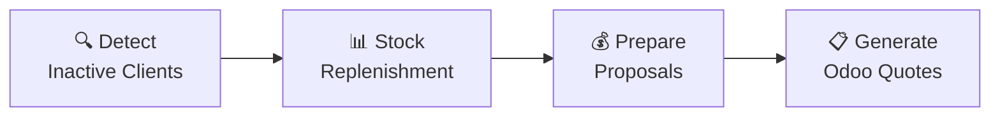

# auto-proposal

Automated quote generation system for Odoo ERP.

**auto-proposal** identifies inactive clients, predicts their stock replenishment needs using AI (Google Gemini), prepares proposals with pricing and MOQ, then generates draft quotes in Odoo.

## Quick Start

1. **Setup**: [Installation & Configuration](./docs/GETTING-STARTED.md)
2. **Learn**: [Architecture Overview](./docs/ARCHITECTURE.md)
3. **Full Docs**: [Complete Documentation](./docs/README.md)

## Main Workflow

## Core Components

- **[Client Inactivity](./docs/features/client-inactivity.md)** - Identifies clients without recent orders
- **[Stock Replenishment](./docs/features/stock-replenishment.md)** - Predicts order quantities using LLM + fallback
- **[Proposal Preparation](./docs/features/proposal-preparation.md)** - Adds pricing and MOQ
- **[Proposal Generation](./docs/features/proposal-generation.md)** - Creates quotes in Odoo
- **[Backtesting](./docs/features/backtesting.md)** - Validates prediction quality

## Stack

- **Backend**: Node.js + TypeScript
- **Task Scheduling**: Trigger.dev
- **ERP**: Odoo (JSON2 API)
- **LLM**: Google Gemini via OpenRouter + Ax framework

---

For detailed documentation, see [docs/README.md](./docs/README.md)
