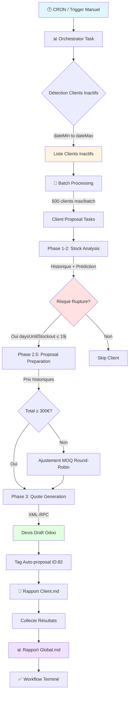

# Auto-Proposal System

## 🎯 Finalité

Génère automatiquement des propositions de commande pour les clients inactifs en analysant leur historique de commandes et en détectant les ruptures de stock imminentes.

---

## 📊 Le Flux Principal

1. **Détection** : Un orchestrateur identifie les clients inactifs (sans commande dans une période configurable)
2. **Analyse** : Pour chaque client, calcul de la consommation moyenne par jour et prédiction du stock restant
3. **Quantité** : Calcul des quantités à commander basé sur la médiane historique (6 mois)
4. **Proposition** : Enrichissement avec prix historiques + ajustement pour atteindre le MOQ de 300€
5. **Devis** : Création automatique du devis draft dans Odoo + génération de rapports markdown



---

## 🏗️ Architecture

| Module | Rôle | Documentation |
|--------|------|---------------|
| **Orchestration** | Coordination Trigger.dev avec batch processing (500 clients/batch) | 📖 [Trigger.dev Tasks](backend/src/trigger/README.md) |
| **Client Inactivity** | Phase 0 : Détection clients inactifs via dateMin/dateMax | 📖 [Inactivity Detection](backend/src/features/client-inactivity/README.md) |
| **Stock Replenishment** | Phase 1-2 : Analyse historique + prédiction rupture + calcul quantités | 📖 [Stock Analysis](backend/src/features/stock-replenishment/README.md) |
| **Proposal Preparation** | Phase 2.5 : Enrichissement prix historiques + ajustement MOQ (300€) | 📖 [Pricing & MOQ](backend/src/features/proposal-preparation/README.md) |
| **Quote Generation** | Phase 3 : Création devis draft Odoo via XML-RPC | 📖 [Odoo Quotes](backend/src/features/proposal-generation/README.md) |
| **Email Sending** | Phase 4 : Envoi email (TODO - actuellement stub) | 📖 [Email Integration](backend/src/features/email-sending/README.md) |
| **Reports** | Phase 5 : Génération rapports markdown (global + par client) | 📖 [Report Generation](backend/src/reports/README.md) |
| **Odoo Infrastructure** | Clients XML-RPC/JSON-RPC pour communication avec l'ERP | 📖 [Odoo Clients](backend/src/infrastructure/odoo/README.md) |
| **Configuration** | Configuration centralisée du système (seuils, stratégies, MOQ) | 📖 [Config](backend/src/config/README.md) |

---

## 📈 Exemple de Flow Complet

**Input :**
- Config : `dateMin = "2025-09-27"`, `dateMax = "2025-10-27"` (30 jours d'inactivité)
- 1536 clients inactifs détectés

**Processing :**
- Batch 1/4 : 500 clients traités en parallèle
- Batch 2/4 : 500 clients traités en parallèle
- Batch 3/4 : 500 clients traités en parallèle
- Batch 4/4 : 36 clients traités en parallèle

**Output (exemple pour 5 clients) :**
- Client A : 10 produits à risque → 307.06€ HT → Devis S39592 ✅
- Client B : 6 produits à risque → 799.10€ HT → Devis S39593 ✅
- Client C : 1 produit à risque → 250€ HT (pas de devis, < 300€)
- Client D : 0 produits à risque → Skip
- Client E : Erreur API Odoo → Failed ❌

**Rapports générés :**
- `/reports-output/global-report-2025-10-27.md` (vue d'ensemble)
- `/reports-output/client-{id}-{name}.md` (5 rapports détaillés)

---

## ⚙️ Configuration Clés

```typescript
// backend/src/config/auto-proposal.ts
{
  // Période d'inactivité (defaults calculés dynamiquement si null)
  inactivityDetection: {
    dateMin: null,             // Si null: aujourd'hui - 30 jours
    dateMax: null,             // Si null: aujourd'hui
  },

  // Analyse stock
  analysisWindowDays: 180,     // 6 mois d'historique
  targetCoverage: 14,          // 14 jours de couverture souhaitée
  leadTime: 5,                 // 5 jours de délai livraison
  // Seuil rupture = 14 + 5 = 19 jours

  // Stratégie quantité (médiane à 4 niveaux)
  quantityStrategy: {
    maxRecentOrderLines: 5,              // Limiter aux 5 dernières commandes
    minOrdersForMediumConfidence: 2,     // ≥2 commandes = Medium
    minOrdersForHighConfidence: 5,       // ≥5 commandes = High
  },

  // Pricing & MOQ
  pricing: {
    minimumOrderAmount: 300,   // MOQ global en euros
  },

  // Quote generation
  quoteGeneration: {
    autoProposalTagId: 82,     // Tag Odoo "Auto-proposal"
  },

  // Workflow
  workflow: {
    generateReports: true,       // Génération rapports markdown
    forceReanalysis: false,      // Exclure clients avec tag 82
  },
}
```

---

## 🚀 Utilisation

### 1. Démarrer les serveurs

```bash
# Terminal 1 : Serveur backend (API Hono)
pnpm dev
# → Démarre sur http://localhost:3000

# Terminal 2 : Serveur Trigger.dev
pnpm trigger:dev
# → Ouvre automatiquement le dashboard Trigger.dev
```

### 2. Lancer l'orchestrator (tous les clients inactifs)

**Via Trigger.dev Dashboard :**
1. Ouvrir http://localhost:3000/trigger
2. Trouver la task `auto-proposal-orchestrator`
3. Cliquer "Test" → Lancer

**Via HTTP :**
```bash
curl -X POST http://localhost:3000/api/orchestrator-task
```

**Formats de dates acceptés :**

Les paramètres `dateMin`, `dateMax` et `analysisEndDate` acceptent plusieurs formats pour faciliter l'usage :

```bash
# Tous ces formats sont équivalents et parsés automatiquement :
curl -X POST http://localhost:3000/api/orchestrator-task \
  -H "Content-Type: application/json" \
  -d '{"config": {"dateMin": "010125"}}'           # Format court JJMMAA

curl -X POST http://localhost:3000/api/orchestrator-task \
  -H "Content-Type: application/json" \
  -d '{"config": {"dateMin": "01/01/25"}}'         # Format JJ/MM/AA

curl -X POST http://localhost:3000/api/orchestrator-task \
  -H "Content-Type: application/json" \
  -d '{"config": {"dateMin": "01/01/2025"}}'       # Format JJ/MM/AAAA

curl -X POST http://localhost:3000/api/orchestrator-task \
  -H "Content-Type: application/json" \
  -d '{"config": {"dateMin": "2025-01-01"}}'       # Format ISO AAAA-MM-JJ
```

**Formats invalides (retournent une erreur explicite) :**
```bash
curl -d '{"config": {"dateMin": "2025/01/01"}}'   # ❌ Slash inversé
curl -d '{"config": {"dateMin": "25-01-01"}}'     # ❌ Ordre invalide
curl -d '{"config": {"dateMin": "hello"}}'        # ❌ Texte
```

**Options utiles :**
```bash
# Mode test : 5 clients max, sans créer de devis
curl -X POST http://localhost:3000/api/orchestrator-task \
  -H "Content-Type: application/json" \
  -d '{"config": {"maxClientsToAnalyze": 5, "skipOdooQuoteGeneration": true}}'

# Dates custom (formats courts acceptés)
curl -X POST http://localhost:3000/api/orchestrator-task \
  -H "Content-Type: application/json" \
  -d '{"config": {"dateMin": "010925", "dateMax": "011025"}}'
```

### 3. Lancer l'analyse d'UN seul client

**Via Trigger.dev Dashboard :**
1. Trouver la task `client-proposal`
2. Cliquer "Test" avec payload :
```json
{
  "client": {
    "id": 81,
    "name": "100% Liégeois"
  }
}
```

**Via HTTP :**
```bash
curl -X POST http://localhost:3000/api/client-task \
  -H "Content-Type: application/json" \
  -d '{"client": {"id": 81, "name": "100% Liégeois"}}'
```

### 4. Voir les résultats

**Rapports générés :**
```bash
# Rapport global
cat reports-output/global-report-2025-10-27.md

# Rapports par client
ls reports-output/client-*.md
```

**Logs Trigger.dev :**
- Voir Terminal 2
- Ou Dashboard Trigger.dev → Runs

---

## 📦 Installation

<details><summary>Prérequis & Configuration</summary>

**Prérequis :**
- Node.js v18+
- pnpm v8+
- Accès Odoo v17

**Installation :**
```bash
git clone <repo-url>
cd auto-proposal
pnpm install
```

**Configuration (`.env`) :**
```bash
ODOO_URL=https://your-odoo.com
ODOO_DB=your-db
ODOO_USERNAME=your-user
ODOO_PASSWORD=your-password
TRIGGER_SECRET_KEY=tr_dev_xxxxx
PORT=3000
```

</details>

<details><summary>Commandes utiles</summary>

### Développement

```bash
# Backend API uniquement
pnpm dev

# Trigger.dev dev mode
pnpm trigger:dev

# Build du backend
pnpm build

# Lancer les tests (si configurés)
pnpm test
```

### Trigger.dev

```bash
# Déployer en production
pnpm trigger:deploy

# Voir les runs récents
pnpm trigger:runs

# Annuler un run
pnpm trigger:cancel <run-id>
```

### Odoo MCP (si installé)

```bash
# Tester la connexion Odoo
mcp__odoo__search_records model="res.partner" domain=[["id","=",3]]

# Vérifier un produit
mcp__odoo__search_records model="product.product" domain=[["id","=",26]]
```

</details>

<details><summary>Paramètres d'orchestration</summary>

### Configuration via payload HTTP

```typescript
POST /api/orchestrator-task
{
  "config": {
    // Période d'inactivité
    "dateMin": "010925",              // Formats: "JJMMAA", "JJ/MM/AA", "JJ/MM/AAAA", "AAAA-MM-JJ"
    "dateMax": "011025",              // (= référence analyse stock)

    // Analyse historique
    "analysisWindowDays": 180,        // 6 mois (défaut)

    // Seuils
    "targetCoverage": 14,             // Jours de couverture (défaut)
    "leadTime": 5,                    // Délai livraison (défaut)
    "moqMinimum": 300,                // MOQ en euros (défaut)

    // Options workflow
    "maxClientsToAnalyze": 5,         // Limiter pour debug (défaut: "all")
    "skipOdooQuoteGeneration": true,  // Mode test sans créer de devis
    "generateReports": true,          // Générer les rapports markdown
    "forceReanalysis": false,         // Inclure clients avec tag 82
  }
}
```

### Exemples de cas d'usage

**Test avec 5 clients, sans créer de devis :**

```json
{
  "config": {
    "maxClientsToAnalyze": 5,
    "skipOdooQuoteGeneration": true
  }
}
```

**Production complète avec tous les clients :**

```json
{
  "config": {
    "maxClientsToAnalyze": "all",
    "skipOdooQuoteGeneration": false,
    "generateReports": true
  }
}
```

**Analyse rétroactive (1er octobre 2025) :**

```json
{
  "config": {
    "dateMin": "010925",
    "dateMax": "011025",
    "skipOdooQuoteGeneration": true
  }
}
```

</details>

---

## 📝 État d'Avancement

### ✅ Implémenté

- **Phase 0** : Détection clients inactifs (dateMin/dateMax)
- **Phase 1** : Détection risque rupture stock (TRIGGER)
- **Phase 2** : Calcul quantités (stratégie médiane)
- **Phase 2.5** : Pricing historique + ajustement MOQ
- **Phase 3** : Génération devis Odoo (draft + tag 82)
- **Phase 5** : Génération rapports markdown
- **Orchestration** : Trigger.dev batch processing (500 clients/batch)

### ⚠️ Implémenté mais NON activé

- **Phase 4** : Envoi email automatique
  - ✅ Code implémenté : `backend/src/features/email-sending/email-sending.service.ts`
  - ✅ Modes TEST/PRODUCTION disponibles
  - ❌ Non appelé dans le workflow (`client-proposal.task.ts`)
  - 📖 Pour activer : Ajouter l'appel `sendQuoteEmail()` après génération devis


---

## 🔗 Documentation Technique

### Par Phase

- **Phase 0** : [Client Inactivity Detection](backend/src/features/client-inactivity/README.md)
- **Phase 1-2** : [Stock Replenishment Analysis](backend/src/features/stock-replenishment/README.md)
- **Phase 2.5** : [Proposal Preparation](backend/src/features/proposal-preparation/README.md)
- **Phase 3** : [Quote Generation](backend/src/features/proposal-generation/README.md)
- **Phase 4** : [Email Sending](backend/src/features/email-sending/README.md)
- **Phase 5** : [Report Generation](backend/src/reports/README.md)

### Infrastructure

- **Orchestration** : [Trigger.dev Tasks](backend/src/trigger/README.md)
- **Odoo** : [Odoo Clients](backend/src/infrastructure/odoo/README.md)
- **Configuration** : [Config](backend/src/config/README.md)

### Guides Spécifiques

- **Stratégie Quantités** : [QUANTITY-STRATEGY.md](backend/src/features/stock-replenishment/docs/QUANTITY-STRATEGY.md)

---

## ⚠️ Limitations Connues

### Pricing (Phase 2.5)

**Problème** : L'API Odoo v17 (XML-RPC) ne permet pas d'obtenir les prix avec pricelist de manière programmatique.

**Impact** :
- Utilise les prix historiques (price_unit de la dernière commande)
- Prix potentiellement obsolètes si pricelist ou paliers ont changé

**Solutions possibles** :
1. Module custom Odoo exposant `_get_pricelist_price()`
2. Merger Phase 2.5 + Phase 3 (laisser Odoo calculer les prix)

### UoM (Unités de Mesure)

Les quantités récupérées d'Odoo sont déjà dans le bon UoM (TU6, TU12, etc.). Aucune conversion nécessaire.

---

## 📚 Ressources

- [Documentation Trigger.dev v3](https://trigger.dev/docs/v3)
- [Odoo XML-RPC API](https://www.odoo.com/documentation/17.0/developer/reference/external_api.html)
- [Référence historique](AUTO-PROPOSAL-SYSTEM.md) (documentation pré-refactoring)
- [Plan de refactoring dateMin/dateMax](REFACTORING-PLAN.md)
- [Validation du refactoring](backend/VALIDATION-REPORT.md)

---


