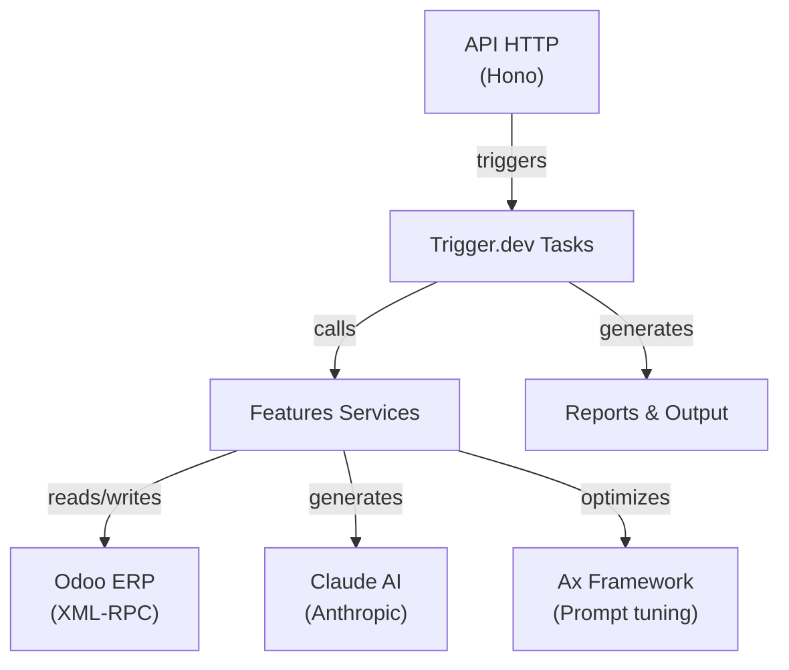

# Architecture

Vue d'ensemble technique du système auto-proposal.

## Stack

- **Runtime**: Node.js 20+ (TypeScript)
- **Web**: Hono (HTTP server sur port 3000)
- **Tasks**: Trigger.dev v4.3.0 (async, scalable)
- **ERP**: Odoo (XML-RPC ou JSON-2)
- **IA**: Claude (Anthropic SDK) + Ax optimization framework
- **Package Manager**: pnpm

## Diagramme d'architecture



## Structure du repo

```
backend/src/
├── index.ts                      # HTTP server + routes
├── config/
│   └── auto-proposal.ts         # Config centralisée
├── features/                     # 5 features principales
│   ├── client-inactivity/
│   ├── stock-replenishment/
│   ├── proposal-preparation/
│   ├── proposal-generation/
│   └── backtesting/
├── trigger/                      # 4 Trigger.dev tasks
│   ├── orchestrator.task.ts
│   ├── client-proposal.task.ts
│   ├── backtest-client.task.ts
│   └── backtest-aggregate.task.ts
├── infrastructure/
│   └── odoo/                     # Odoo clients (XML-RPC/JSON-2)
├── reports/                      # Report generators
├── optimization/                 # LLM prompt optimization (Ax)
└── utils/
```

## Patterns

### Service Layer
Chaque feature expose des services avec types stricts:
```
feature/
├── service.ts          # Business logic
├── types.ts            # TypeScript interfaces
└── utils/              # Helpers
```

### Factory Pattern
Clients Odoo créés par factory:
```typescript
const client = odooService.createClient(config);
```

### Task Orchestration
Trigger.dev tasks avec `batchTriggerAndWait` pour traiter 500 clients/batch.

## Flux de données

```
HTTP Request
    ↓
Route Handler (/routes/*.ts)
    ↓
Trigger.dev Task (/trigger/*.task.ts)
    ↓
Feature Services (/features/**/*.service.ts)
    ↓
Odoo Client + LLM Service
    ↓
Reports & Output
```

## Configuration

Voir [`backend/src/config/auto-proposal.ts`](../backend/src/config/auto-proposal.ts):

```typescript
{
  odooApiType: 'xml-rpc' | 'json-2',
  replenishmentThreshold: 30,      // days
  moqMinimum: 300,                 // EUR
  productCategoryExclusions: [...], // 70+ categories
}
```

## Variables d'environnement

```bash
# Odoo
ODOO_URL=https://...
ODOO_DB=...
ODOO_USERNAME=...
ODOO_PASSWORD=...

# Trigger.dev
TRIGGER_API_KEY=...
TRIGGER_API_URL=...

# Anthropic (Claude)
ANTHROPIC_API_KEY=...
```

---

**Voir aussi**: [Features](./features/) · [Tasks](./tasks/) · [Infrastructure](./infrastructure/)
