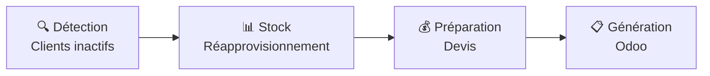

# auto-proposal - Documentation

**auto-proposal** est un système automatisé de génération de devis pour Odoo ERP. Il identifie les clients inactifs, utilise l'IA (Claude) pour prédire leurs besoins de réapprovisionnement, prépare des propositions avec tarification et MOQ (Minimum Order Quantity), puis génère des devis draft dans Odoo.

## Flux principal

## Documentation

### Pour commencer
- **[Getting Started](./GETTING-STARTED.md)** - Installation et premiers pas
- **[Architecture](./ARCHITECTURE.md)** - Vue d'ensemble technique

### Features (Fonctionnalités)
Chaque module du système:

| Feature | Description |
|---------|-------------|
| **[Client Inactivity](./features/client-inactivity.md)** | Identifie les clients sans commande récente |
| **[Stock Replenishment](./features/stock-replenishment.md)** | Calcule les quantités à commander (LLM + fallback) |
| **[Proposal Preparation](./features/proposal-preparation.md)** | Ajoute prix et MOQ |
| **[Proposal Generation](./features/proposal-generation.md)** | Crée les devis dans Odoo |
| **[Backtesting](./features/backtesting.md)** | Valide la qualité des prédictions |

### Tasks (Workflows)
Orchestration par Trigger.dev:

| Task | Description |
|------|-------------|
| **[Orchestrator](./tasks/orchestrator.md)** | Workflow complet (détection → devis) |
| **[Client Proposal](./tasks/client-proposal.md)** | Traite un client |
| **[Backtest Client](./tasks/backtest-client.md)** | Teste prédictions vs réalité |
| **[Backtest Aggregate](./tasks/backtest-aggregate.md)** | Statistiques agrégées |

### Infrastructure
- **[Odoo Integration](./infrastructure/odoo.md)** - Intégration ERP
- **[LLM Services](./infrastructure/llm.md)** - Claude + optimisation

---

**Version**: 1.0
**Stack**: Node.js + TypeScript + Trigger.dev + Odoo + Claude
