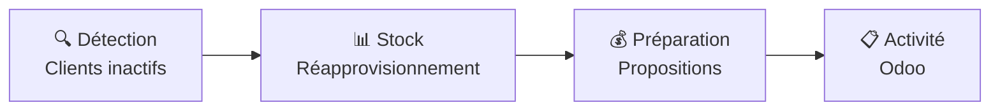

# auto-proposal - Documentation

**auto-proposal** est un système automatisé de suggestions de commande pour Odoo ERP. Il identifie les clients inactifs, utilise l'IA (Google Gemini) pour prédire leurs besoins de réapprovisionnement, prépare des propositions avec tarification et MOQ (Minimum Order Quantity), puis crée dans Odoo une activité « Suggestion commande » assignée au vendeur du client. Aucun devis n'est créé.

## Flux principal

```mermaid
flowchart LR
    A["🔍 Détection<br/>Clients inactifs"] --> B["📊 Stock<br/>Réapprovisionnement"]
    B --> C["💰 Préparation<br/>Propositions"]
    C --> D["📋 Activité<br/>Odoo"]
```

## Documentation

### Pour commencer
- **[Getting Started](./GETTING-STARTED.md)** - Installation et premiers pas
- **[Architecture](./ARCHITECTURE.md)** - Vue d'ensemble technique

### Features (Fonctionnalités)
Chaque module du système:

| Feature | Description |
|---------|-------------|
| **[Client Inactivity](./features/client-inactivity.md)** | Identifie les clients sans commande récente |
| **[Stock Replenishment](./features/stock-replenishment.md)** | Calcule les quantités à commander (LLM + fallback) |
| **[Proposal Preparation](./features/proposal-preparation.md)** | Ajoute prix et MOQ |
| **[Suggestion Activity](./features/suggestion-activity.md)** | Crée l'activité « Suggestion commande » dans Odoo |
| **[Backtesting](./features/backtesting.md)** | Valide la qualité des prédictions |

### Tasks (Workflows)
Orchestration par Trigger.dev:

| Task | Description |
|------|-------------|
| **[Orchestrator](./tasks/orchestrator.md)** | Workflow complet (détection → activités) |
| **[Client Proposal](./tasks/client-proposal.md)** | Traite un client |
| **[Backtest Client](./tasks/backtest-client.md)** | Teste prédictions vs réalité |
| **[Backtest Aggregate](./tasks/backtest-aggregate.md)** | Statistiques agrégées |

### Infrastructure
- **[Odoo Integration](./infrastructure/odoo.md)** - Intégration ERP
- **[LLM Services](./infrastructure/llm.md)** - Gemini + Ax framework

---

**Version**: 1.0
**Stack**: Node.js + TypeScript + Trigger.dev + Odoo + Google Gemini
