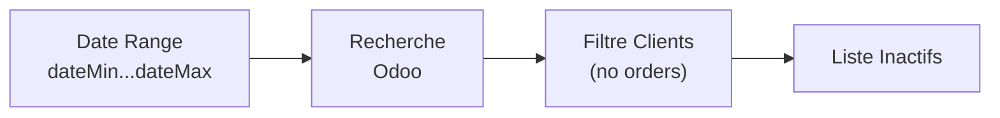

# Client Inactivity

Identifie les clients qui n'ont pas commandé depuis une certaine période, pour ciblage des propositions.

## Objectif

Trouver les clients inactifs dans une fenêtre de temps donnée, pour déclencher des campagnes de relance via auto-proposal.

## Flux



## Entrée / Sortie

**Fonction principale:**
```typescript
getInactiveClients(
  dateMin: string,                     // "YYYY-MM-DD HH:MM:SS"
  dateMax: string,                     // "YYYY-MM-DD HH:MM:SS"
  excludeAutoProposalTagId?: number,   // From config (force reanalysis)
  excludedPartnerTagId?: number | null, // From config (permanent exclude)
  companyId?: number                   // From config (multi-company filter)
): Promise<InactiveClient[]>
```

**Logic:**
- `excludeAutoProposalTagId`: Exclut les commandes avec ce tag du calcul d'activité
- `companyId`: Filtre les commandes par société (ex: FOODPRINT SRL = 3)
- Sinon → clients sans order récente = inactifs

**Résultat:**
```typescript
InactiveClient[] = {
  id: number;
  name: string;
  email?: string;
}[]
```

## Configuration

Pas de configuration spécifique, utilise la config générale du système.

## Cas d'usage

### 1. Détecter clients inactifs

```typescript
// Clients inactifs entre 26 sept et 26 oct 2025
const inactive = await getInactiveClients({
  dateMin: "2025-09-26",
  dateMax: "2025-10-26"
});
// → liste de 42 clients
```

### 2. Force reanalysis

Inclure les clients déjà tagués par auto-proposal:

```typescript
const inactive = await getInactiveClients(
  "2025-09-26",
  "2025-10-26",
  undefined,  // excludeAutoProposalTagId = force reanalysis
  undefined,
  autoProposalConfig.defaultCompanyId
);
```

### 3. Exclure clients permanents

Exclure clients avec tag "exclude-auto-proposal":

```typescript
const inactive = await getInactiveClients(
  "2025-09-26",
  "2025-10-26",
  autoProposalConfig.quoteGeneration.autoProposalTagId,
  autoProposalConfig.inactivityDetection.excludedPartnerTagId,
  autoProposalConfig.defaultCompanyId
);
```

## Intégration

Utilisé par:
- **[Orchestrator task](../tasks/orchestrator.md)** - Détecte clients au démarrage
- Workflows de détection préalable

Voir aussi:
- **[Stock Replenishment](./stock-replenishment.md)** - Traitement des clients détectés

---

**Source**: `backend/src/features/client-inactivity/`
