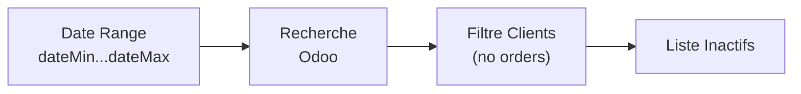

# Client Inactivity

Identifie les clients qui n'ont pas commandé depuis une certaine période, pour ciblage des propositions.

## Objectif

Trouver les clients inactifs dans une fenêtre de temps donnée, pour déclencher des campagnes de relance via auto-proposal.

## Flux



## Entrée / Sortie

**Fonction principale:**
```typescript
getInactiveClients(
  dateMin: string,                     // "YYYY-MM-DD HH:MM:SS"
  dateMax: string,                     // "YYYY-MM-DD HH:MM:SS"
  excludeAutoProposalTagId?: number,   // Default: 82 (force reanalysis)
  excludedPartnerTagId?: number | null // Permanent exclude
): Promise<InactiveClient[]>
```

**Logic:**
- `excludeAutoProposalTagId`: Si 82 → clients avec ONLY tag 82 orders = inactifs
- Sinon → clients sans order récente = inactifs

**Résultat:**
```typescript
InactiveClient[] = {
  id: number;
  name: string;
  email?: string;
}[]
```

## Configuration

Pas de configuration spécifique, utilise la config générale du système.

## Cas d'usage

### 1. Détecter clients inactifs

```typescript
// Clients inactifs entre 26 sept et 26 oct 2025
const inactive = await getInactiveClients({
  dateMin: "2025-09-26",
  dateMax: "2025-10-26"
});
// → liste de 42 clients
```

### 2. Force reanalysis

Inclure les clients déjà tagués par auto-proposal (tag 82):

```typescript
const inactive = await getInactiveClients({
  dateMin: "2025-09-26",
  dateMax: "2025-10-26",
  excludeAutoProposalTagId: undefined  // force reanalysis
});
```

### 3. Exclure clients permanents

Exclure clients avec tag "do not contact" (e.g., tag 195):

```typescript
const inactive = await getInactiveClients({
  dateMin: "2025-09-26",
  dateMax: "2025-10-26",
  excludedPartnerTagId: 195
});
```

## Intégration

Utilisé par:
- **[Orchestrator task](../tasks/orchestrator.md)** - Détecte clients au démarrage
- Workflows de détection préalable

Voir aussi:
- **[Stock Replenishment](./stock-replenishment.md)** - Traitement des clients détectés

---

**Source**: `backend/src/features/client-inactivity/`
