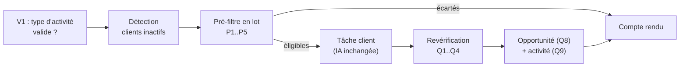

# Suggestion Activity

Crée dans Odoo une activité « Suggestion commande <client> » pour chaque client inactif éligible, à la place des anciens devis automatiques.

## Objectif

Rappeler au vendeur de relancer un client inactif, avec ce qu'il faut lui proposer :
- une activité assignée au **vendeur de la fiche client**, échéance le jour du lancement ;
- posée sur la **plus ancienne opportunité ouverte** du client (créée si besoin) ;
- une description qui donne la date de dernière commande, puis les produits habituels et optionnels.

Aucun devis n'est créé. Les 246 devis automatiques existants (étiquette 82) ne sont ni modifiés ni supprimés.

## Flux



## Règle d'éligibilité

Une seule implémentation : `decideEligibility(ctx, runDate, delayDays)` (`eligibility.utils.ts`), appelée en lot par le pré-filtre de l'orchestrateur puis, pour un client, par la revérification de la tâche juste avant l'écriture.

Ordre des contrôles, le premier qui échoue donne la raison :

| # | Contrôle | Raison (`reason`) | Libellé du compte rendu |
|---|----------|-------------------|-------------------------|
| 1 | Le client a un vendeur (`res.partner.user_id`) | `no_salesperson` | pas de vendeur |
| 2 | Le vendeur n'est pas archivé (`res.users.active`, lu par `read`) | `inactive_salesperson` | vendeur inactif |
| 3 | Le vendeur a accès à FOODPRINT (`res.users.company_ids`) | `salesperson_no_company_access` | vendeur sans accès à FOODPRINT |
| 4 | Aucune activité « Suggestion commande » ouverte sur ses opportunités | `open_activity` | activité déjà ouverte |
| 5 | Aucune relance depuis moins de 21 jours | `recent_follow_up` | relancé il y a moins de 3 semaines (JJ/MM/AAAA) |
| 5 | Au moins un produit suggéré (après l'IA) | `no_products` | aucun produit suggéré |

Une erreur donne le libellé « erreur (message) ».

**Opportunités du client** : `partner_id.commercial_partner_id = client` (la société et ses contacts), `type = opportunity`, société analysée uniquement (`company_id = companyId`, les opportunités sans société sont ignorées). Les pistes ne comptent pas.

**Relance** : dernier `mail.message` portant `mail_activity_type_id` = le type, sur ces opportunités (archivées comprises). Il est posté par Odoo quand l'activité passe en fait, et par le module quand elle disparaît sans être passée en fait. Le délai se compte en jours calendaires, de date à date (`isWithinFollowUpDelay`) : passée en fait le 02/10, le client est bloqué jusqu'au 22/10 et éligible le 23/10. La partie date du `mail.message.date` (UTC) est utilisée telle quelle.

**Jour du lancement** (`runDate`) : date d'exécution en Europe/Paris (`getRunDateParis`).

## Pré-filtre en lot (orchestrateur, avant l'IA)

`buildPartnerContexts` lit Odoo en un nombre fixe d'appels, quel que soit le nombre de clients (~1 700 par lancement) :

| # | Lecture | Méthode `OdooClient` |
|---|---------|----------------------|
| P1 + P2 | vendeurs et équipes (`res.partner`, `res.users`) | `getSalesContexts` |
| P3 + P3b | opportunités, archivées comprises, rattachées à la société cliente | `getLeadIdsByCommercialPartners` |
| P4 | activités ouvertes du type | `findOpenSuggestionActivities` |
| P5 | traces depuis `runDate − 21 j` (maximum calculé en code) | `findSuggestionTracesSince` |

P4 et P5 ne sont pas émises si aucun client n'a d'opportunité. Puis `prefilterEligibility` applique la règle et `selectClientsToTrigger` sépare les clients à déclencher des écartés, qui entrent directement dans le compte rendu avec leur raison. Un client absent du pré-filtre (introuvable dans Odoo) est déclenché quand même : la revérification le signale.

## Tâche client (après l'IA)

`processClientSuggestion(input, deps)` (`process-client.service.ts`), dépendances injectées :

1. Aucun produit suggéré → `skipped` / `no_products`, sans lecture Odoo.
2. Si `eligibilityCheck` : revérification complète pour ce client (Q1 + Q1b vendeur, Q2 opportunités, Q3 activité ouverte, Q4 dernière trace). Protège une relance Trigger.dev, des tâches parallèles, et une tâche lancée seule par la route.
3. Q5 : plus ancienne opportunité ouverte (`active`, étape non gagnée, `create_date asc, id asc`).
4. Q6 : dernière commande confirmée (`sale`/`done`, société analysée), pour la description.
5. Mode test (`skipOdooWrite`) ou `eligibilityCheck: false` → `would_create`, aucune écriture.
6. Sinon écriture : opportunité si aucune n'est ouverte (Q8), puis activité (Q9).

Garde-fou : la tâche lève une erreur si `eligibilityCheck` est actif et que l'id du type d'activité vaut 0 (non configuré).

**Erreurs** : une erreur de lecture remonte (relance Trigger.dev, 3 tentatives). Une erreur d'écriture devient un `outcome` `error` ; si l'opportunité a été créée sans son activité, son id est signalé (`leadCreatedId`). À la tentative suivante, l'opportunité créée est retrouvée par Q5 et réutilisée : pas de doublon.

## Écritures Odoo (mode réel uniquement)

**Opportunité (Q8)**, seulement si le client n'en a aucune ouverte :

| Champ | Valeur |
|-------|--------|
| `name` | « Suggestion commande <client> » |
| `type` | `opportunity` |
| `partner_id` | client |
| `user_id` | vendeur de la fiche client |
| `team_id` | équipe du client, sinon celle du vendeur, sinon vide |
| `company_id` | société analysée |

L'étape est laissée à Odoo (première étape non repliée de l'équipe), aucun montant.

**Activité (Q9)** : `res_id` (opportunité), `activity_type_id`, `summary` « Suggestion commande <client> », `note` (HTML), `date_deadline` = `runDate`, `user_id` = vendeur.

`res_model_id` n'est pas envoyé : le compte « Suggestions automatiques » ne peut pas lire `ir.model`. L'appel passe `context: { default_res_model: "crm.lead" }` et Odoo remplit `res_model_id` lui-même. La notification standard d'Odoo au vendeur part au nom de « Suggestions automatiques ».

## Description de l'activité

Construite par `buildActivityNote` (`activity-note.utils.ts`), fonction pure :

```html
<p>Dernière commande : 16/08/2026</p>
<p>Produits que ce client commande régulièrement et qu'il devrait bientôt recommander :</p>
<ul><li>Moutarde à l'ancienne 200 g — 6 TU6 — dernière commande : 16/08/2026</li>…</ul>
<p>Produits commandés plus rarement par ce client, à lui proposer en complément :</p>
<ul><li>Ketchup artisanal 300 ml — 3 TU6 — dernière commande : 17/06/2026</li></ul>
```

- **Habituels / optionnels** (`splitProducts`) : même règle que l'ancien devis, `calculation_metadata.confidence === "low"` → optionnel, sinon habituel.
- **Quantité** : `quantity_to_order` arrondie, suivie de l'unité de vente (`product_uom`).
- **Date par produit** : plus récente `order_history[].date_order`, le même historique que la suggestion.
- **Dates** : jour calendaire de Paris (`odooDatetimeToParisDate`), format JJ/MM/AAAA.
- Sans commande confirmée : « Dernière commande : aucune commande confirmée ».
- Une liste vide est omise avec sa phrase. Les noms sont échappés.
- Les deux phrases sont dans `autoProposalConfig.activity` (à valider par la cliente).

## Module Odoo `moutarderie_suggestion_commande`

Livré dans `odoo/addons/moutarderie_suggestion_commande/` (Odoo 17.0, dépendances `crm` + `sale`, aucune dépendance Enterprise). Il fournit :

- **Type d'activité « Suggestion commande »** : réservé à `crm.lead`, `keep_done` (une activité faite reste visible, archivée).
- **Compte « Suggestions automatiques »** (`suggestions.auto`) : utilisateur interne sans mot de passe, groupe « Ventes : tous les documents », rattaché à toutes les sociétés à l'installation. Il a une adresse e-mail (`suggestions.auto@example.com`), sans laquelle Odoo refuse de notifier le vendeur ; l'adresse réelle est à valider avant la staging.

Et deux comportements :

1. **Fermeture immédiate** (`sale.order.create`) : à la création d'un devis, quel que soit le canal (formulaire, opportunité, API, panier e-shop), les activités ouvertes du type sur les opportunités du même client (société ou contact) **et de la même société Odoo** passent en fait, avec le message « Devis S… créé le JJ/MM/AAAA pour … ». Annuler ou supprimer le devis ensuite ne rouvre rien.
2. **Trace de disparition** (`mail.activity.unlink`) : une activité du type supprimée sans être passée en fait (suppression manuelle, opportunité marquée perdue ou archivée) laisse un message daté sur l'opportunité, qui porte le type. Le délai de 21 jours s'applique donc aussi dans ce cas.

Installation, tests et clé API : voir le README du module.

## Mode test et backtest

| Option | Défaut | Effet |
|--------|--------|-------|
| `skipOdooWrite` | `true` | Lectures uniquement ; `outcome` `would_create` ; le compte rendu dit ce qui aurait été créé. Seule la tâche planifiée du vendredi passe `false`. |
| `eligibilityCheck` | `true` | `false` en backtest : pas de décision d'éligibilité et jamais d'écriture, même avec `skipOdooWrite: false`. |
| `runDate` | aujourd'hui (Paris) | Échéance de l'activité, base du délai. |

## Résultat par client (`outcome`)

```typescript
type SuggestionActivityOutcome =
  | { kind: "created"; activityId; leadId; leadName; leadCreated; salespersonId; salespersonName; dateDeadline }
  | { kind: "would_create"; leadId?; leadName?; leadCreated; salespersonId?; salespersonName? }   // mode test
  | { kind: "skipped"; reason: SkipReason; label: string; detail? }
  | { kind: "error"; message: string; leadCreatedId? };
```

Chaque client analysé a exactement un `outcome`, y compris ceux écartés avant l'IA.

## Compte rendu

Le compte rendu global (`reports-output/global-report-YYYY-MM-DD.md`), en français, contient après les statistiques :

1. **Mode :** TEST (aucune écriture Odoo) ou RÉEL
2. **Activités créées (N)** — client, vendeur, opportunité, nouvelle ?, activité (en mode test : « Activités qui auraient été créées »)
3. **Opportunités créées (N)**
4. **Clients écartés (N)** — client, raison (hors « aucun produit suggéré »)
5. **Erreurs (N)** — client, message, opportunité créée sans activité
6. Exemples détaillés et tableau, limités aux clients avec au moins un produit suggéré
7. **Aucun produit suggéré (N)** — liste simple des noms, en dernier

Voir [Reports](../../backend/src/reports/README.md).

## Configuration

```typescript
activity: {
  suggestionActivityTypeId: Number(process.env.ODOO_SUGGESTION_ACTIVITY_TYPE_ID) || 0,
  followUpDelayDays: 21,
  summaryPrefix: "Suggestion commande",
  leadNamePrefix: "Suggestion commande",
  introUsual: "Produits que ce client commande régulièrement et qu'il devrait bientôt recommander :",
  introOptional: "Produits commandés plus rarement par ce client, à lui proposer en complément :",
}
```

Au début de chaque lancement, l'orchestrateur vérifie en lecture seule que l'id désigne bien « Suggestion commande » sur `crm.lead` (V1), sinon il s'arrête avant tout traitement. `0` = valeur de prod pas encore relevée. Voir [Configuration](../../backend/src/config/README.md).

## Validation locale

Scénario C du quickstart déroulé le 30/09/2026 sur l'Odoo 17 local (Docker) alimenté par `odoo/dev/seed_local.py` : mode test sans écriture, mode réel (6 activités, 3 opportunités créées, clients écartés avec la bonne raison), second lancement sans aucune création, devis en société A qui ferme l'activité et devis en société B qui la laisse ouverte, opportunité perdue qui laisse une trace datée, relance suivante écartée avec la date du jour. La validation sur une copie de prod (staging Odoo.sh) reste à faire avant la mise en service.

## Intégration

Utilisé par :
- **[Orchestrator task](../tasks/orchestrator.md)** — V1 et pré-filtre en lot
- **[Client Proposal task](../tasks/client-proposal.md)** — Phase 3

Voir aussi :
- **[Proposal Preparation](./proposal-preparation.md)** — Étape précédente (produits et quantités)
- **[Odoo Integration](../infrastructure/odoo.md)** — Méthodes `OdooClient`, compte API, module

---

**Source** : `backend/src/features/suggestion-activity/`, `odoo/addons/moutarderie_suggestion_commande/`
