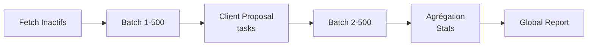

# Orchestrator Task

Task principal qui exécute le workflow complet: détection clients inactifs → génération devis.

## Objectif

Orchestrer la génération de devis pour tous les clients inactifs dans une période donnée.

## Flux



## Payload

```typescript
{
  config?: {
    dateMin?: string;              // "YYYY-MM-DD HH:MM:SS" or "YYYY-MM-DD"
    dateMax?: string;              // Same format
    replenishmentThreshold?: 30;   // Days
    moqMinimum?: 300;              // EUR
    skipOdooQuoteGeneration?: boolean;  // Default: true (TEST mode)
    maxClientsToAnalyze?: number | "all";
    forceReanalysis?: boolean;     // Default: false
    generateReports?: boolean;     // Default: true
    excludedPartnerTagId?: number;
  };
}
```

**Defaults:**
- `skipOdooQuoteGeneration: true` ← TEST mode par défaut (pas de création Odoo)
- `forceReanalysis: false` ← Ignore les commandes avec tag 82 dans le calcul d'activité (évite de réanalyser les clients déjà proposés)
- `generateReports: true` ← Générer markdown/JSON
- `excludedPartnerTagId: 196` ← Tag "Exclude-Auto-Proposal" — exclut définitivement ces clients de l'analyse d'inactivité

## Résultat

```typescript
{
  success: boolean;
  config: OrchestratorConfig;
  statistics: {
    totalInactiveClients: number;
    clientsProcessed: number;
    clientsWithOrderHistory: number;
    clientsWithRisk: number;
    clientsWithoutRisk: number;
    clientsFailed: number;
    quotesGenerated: number;
    reportsGenerated: number;
    totalValue: number;             // EUR HT
  };
  globalReport?: {
    markdown: string;
    path: string;
  };
  executionTime: number;
}
```

## Dépendances

- **[Client Inactivity](../features/client-inactivity.md)** - Détecte clients
- **[Client Proposal task](./client-proposal.md)** - Triggered en batches
- Odoo API (client fetch)
- Report generators

## Exemples

### 1. Production complet

```bash
curl -X POST http://localhost:3000/routes/orchestrator-task \
  -H "Content-Type: application/json" \
  -d '{
    "config": {
      "dateMin": "2025-09-26",
      "dateMax": "2025-10-26",
      "skipOdooQuoteGeneration": false,
      "maxClientsToAnalyze": "all"
    }
  }'
```

**Response:**
```json
{
  "success": true,
  "statistics": {
    "totalInactiveClients": 42,
    "clientsProcessed": 42,
    "quotesGenerated": 28,
    "totalValue": 12540
  }
}
```

### 2. Test mode (skip Odoo)

```bash
curl -X POST http://localhost:3000/routes/orchestrator-task \
  -H "Content-Type: application/json" \
  -d '{
    "config": {
      "dateMin": "2025-09-26",
      "dateMax": "2025-10-26",
      "skipOdooQuoteGeneration": true,
      "maxClientsToAnalyze": 5
    }
  }'
```

### 3. Force reanalysis

Réanalyse les clients même s'ils ont déjà des devis auto-générés (tag 82) :

```bash
curl -X POST http://localhost:3000/routes/orchestrator-task \
  -H "Content-Type: application/json" \
  -d '{
    "config": {
      "dateMin": "2025-09-26",
      "dateMax": "2025-10-26",
      "forceReanalysis": true
    }
  }'
```

## Batch Processing

Traite 500 clients par batch:
- Batch 1: clients 1-500 (parallèle)
- Batch 2: clients 501-1000 (parallèle)
- ...continue jusqu'à fin

Chaque batch lance `client-proposal` tasks en parallèle.

## Voir aussi

- **[Client Proposal task](./client-proposal.md)** - Déclenchée par orchestrator
- **[Client Inactivity](../features/client-inactivity.md)** - Détection
- **[Getting Started](../GETTING-STARTED.md)** - Comment lancer

---

**Source**: `backend/src/trigger/orchestrator.task.ts`
