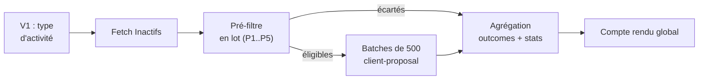

# Orchestrator Task

Task principal qui exécute le workflow complet : détection des clients inactifs → pré-filtre d'éligibilité → activité « Suggestion commande » pour chaque client éligible.

## Objectif

Pour tous les clients inactifs d'une période, créer dans Odoo une activité « Suggestion commande » assignée au vendeur (plus aucun devis), et produire un compte rendu qui classe chaque client : activité créée, écarté (avec la raison) ou en erreur.

## Flux


```mermaid
flowchart LR
    V["V1 : type<br/>d'activité"] --> A["Fetch Inactifs"]
    A --> P["Pré-filtre<br/>en lot (P1..P5)"]
    P -->|éligibles| B["Batches de 500<br/>client-proposal"]
    P -->|écartés| E["Agrégation<br/>outcomes + stats"]
    B --> E
    E --> F["Compte rendu global"]
```

1. **V1** : lecture du type d'activité configuré (`autoProposalConfig.activity.suggestionActivityTypeId`). S'il n'existe pas, ne s'appelle pas « Suggestion commande » ou n'est pas réservé à `crm.lead`, la tâche lève une erreur explicite et rien n'est lancé.
2. **Détection** des clients inactifs (inchangée), puis `maxClientsToAnalyze`.
3. **Pré-filtre en lot**, avant l'IA : vendeurs, opportunités, activités ouvertes et relances récentes de tous les clients en quelques lectures Odoo. Les clients sans vendeur, avec un vendeur archivé, avec une activité déjà ouverte ou relancés il y a moins de 21 jours ne déclenchent aucune tâche : ils entrent directement dans les `outcomes` avec leur raison.
4. **Tâches `client-proposal`** pour les éligibles seulement, par lots de 500, avec `skipOdooWrite`, `companyId`, `runDate` et `eligibilityCheck: true`. Une tâche en échec après ses tentatives donne un `outcome` `error`.
5. **Agrégation** et compte rendu global.

Détail des règles : [Suggestion Activity](../features/suggestion-activity.md).

## Payload

```typescript
{
  config?: {
    dateMin?: string;              // "YYYY-MM-DD HH:MM:SS" or "YYYY-MM-DD"
    dateMax?: string;              // Same format
    replenishmentThreshold?: 30;   // Days
    moqMinimum?: 300;              // EUR
    skipOdooWrite?: boolean;       // Default: true (TEST mode)
    maxClientsToAnalyze?: number | "all";
    forceReanalysis?: boolean;     // Default: false
    generateReports?: boolean;     // Default: true
    excludedPartnerTagId?: number; // Default: 196
    companyId?: number;            // Default: 3 (FOODPRINT SRL)
  };
}
```

**Defaults:**
- `skipOdooWrite: true` ← TEST mode par défaut : lectures uniquement, ni activité ni opportunité créée. Seule la tâche planifiée `orchestrator-daily-7am` passe `false`.
- `forceReanalysis: false` ← Ignore les commandes avec tag 82 (anciens devis automatiques) dans le calcul d'activité
- `generateReports: true` ← Générer markdown/JSON
- `excludedPartnerTagId: 196` ← Tag "Exclude-Auto-Proposal" — exclut définitivement ces clients de l'analyse d'inactivité
- `companyId: 3` ← Toutes les lectures et écritures sont filtrées sur cette société

`skipOdooQuoteGeneration` n'existe plus : un payload qui l'envoie encore est en mode test.

Le jour du lancement (`runDate`) est la date d'exécution en Europe/Paris. Il sert d'échéance aux activités et de base au délai de 21 jours.

## Résultat

```typescript
{
  success: boolean;
  config: OrchestratorConfig;
  mode: "test" | "real";
  statistics: {
    totalInactiveClients: number;
    clientsProcessed: number;
    clientsWithOrderHistory: number;
    clientsWithRisk: number;          // clients avec au moins un produit suggéré
    clientsWithoutRisk: number;
    activitiesCreated: number;        // ex quotesGenerated
    leadsCreated: number;             // opportunités créées pour porter une activité
    wouldCreate: number;              // mode test : activités qui auraient été créées
    clientsSkipped: number;
    clientsFailed: number;
    reportsGenerated: number;
    totalValue: number;               // EUR HT
  };
  outcomes: Array<{
    clientId: number;
    clientName: string;
    outcome: SuggestionActivityOutcome; // created | would_create | skipped | error
  }>;
  globalReport?: {
    markdown: string;
    path: string;
  };
  executionTime: number;
}
```

Invariant : `activitiesCreated + wouldCreate + clientsSkipped + clientsFailed = clientsProcessed` (chaque client dans une seule catégorie).

## Compte rendu global

`reports-output/global-report-YYYY-MM-DD.md`, en français : statistiques, **Mode**, puis « Activités créées », « Opportunités créées », « Clients écartés », « Erreurs », les exemples détaillés et le tableau des clients avec produits suggérés, et en dernier « Aucun produit suggéré » (liste simple). En mode test, les titres deviennent « … qui auraient été créées ».

## Dépendances

- **[Client Inactivity](../features/client-inactivity.md)** - Détecte clients
- **[Suggestion Activity](../features/suggestion-activity.md)** - V1 et pré-filtre en lot
- **[Client Proposal task](./client-proposal.md)** - Triggered en batches
- Odoo API (compte « Suggestions automatiques »)
- Report generators

## Exemples

### 1. Mode réel

Réservé au lancement planifié en prod ; un lancement manuel qui écrit en prod est une exception décidée explicitement.

```bash
curl -X POST http://localhost:3000/orchestrator-task \
  -H "Content-Type: application/json" \
  -d '{
    "config": {
      "skipOdooWrite": false,
      "maxClientsToAnalyze": "all"
    }
  }'
```

La route renvoie l'id du run Trigger.dev ; le résultat du run ressemble à :

```json
{
  "success": true,
  "mode": "real",
  "statistics": {
    "totalInactiveClients": 11,
    "clientsProcessed": 11,
    "activitiesCreated": 6,
    "leadsCreated": 3,
    "wouldCreate": 0,
    "clientsSkipped": 5,
    "clientsFailed": 0
  }
}
```

### 2. Mode test (défaut)

```bash
curl -X POST http://localhost:3000/orchestrator-task \
  -H "Content-Type: application/json" \
  -d '{
    "config": {
      "dateMin": "2025-09-26",
      "dateMax": "2025-10-26",
      "maxClientsToAnalyze": 5
    }
  }'
```

### 3. Odoo local (Docker)

Les ids diffèrent de la prod : passer ceux affichés par `odoo/dev/seed_local.py`.

```bash
curl -X POST http://localhost:3000/orchestrator-task \
  -H "Content-Type: application/json" \
  -d '{"config":{"companyId":2,"excludedPartnerTagId":1}}'
```

### 4. Force reanalysis

Les commandes portant le tag 82 (anciens devis automatiques) ne comptent plus comme activité récente :

```bash
curl -X POST http://localhost:3000/orchestrator-task \
  -H "Content-Type: application/json" \
  -d '{
    "config": {
      "dateMin": "2025-09-26",
      "dateMax": "2025-10-26",
      "forceReanalysis": true
    }
  }'
```

Aucun risque de doublon : une activité déjà ouverte ou une relance de moins de 21 jours écarte le client.

## Batch Processing

Traite 500 clients éligibles par batch :
- Batch 1 : éligibles 1-500 (parallèle)
- Batch 2 : éligibles 501-1000 (parallèle)
- ...continue jusqu'à fin

Chaque batch lance `client-proposal` tasks en parallèle. Les clients écartés par le pré-filtre ne sont pas déclenchés : l'IA n'est pas appelée pour eux.

## Voir aussi

- **[Client Proposal task](./client-proposal.md)** - Déclenchée par orchestrator
- **[Suggestion Activity](../features/suggestion-activity.md)** - Règles et écritures
- **[Client Inactivity](../features/client-inactivity.md)** - Détection
- **[Getting Started](../GETTING-STARTED.md)** - Comment lancer

---

**Source**: `backend/src/trigger/orchestrator.task.ts`
