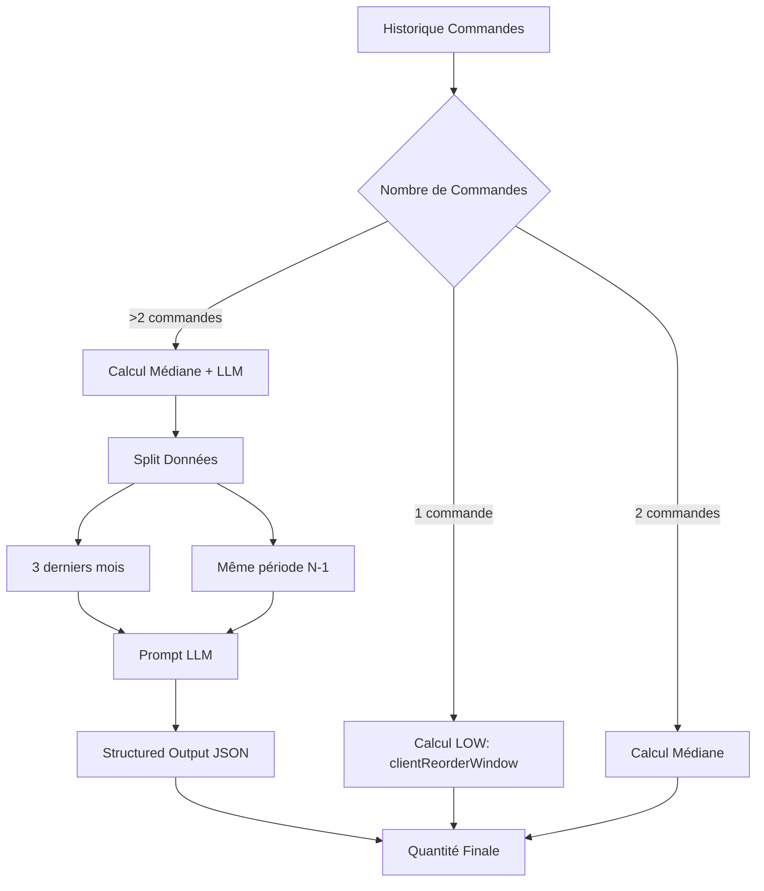

# Rapport d'Analyse Approfondie : Système de Prédiction de Quantités par LLM pour Réapprovisionnement B2B

## Résumé Exécutif

Ce rapport analyse un système hybride de prédiction de quantités pour le réapprovisionnement automatique dans le secteur agroalimentaire B2B. Le système combine une approche statistique basique (médiane) avec un modèle LLM (Moonshot AI Kimi K2 Thinking via OpenRouter) pour prédire les quantités à commander. L'analyse révèle des problèmes structurels critiques dans l'approche actuelle, avec un MAPE moyen de 37.89% et une distribution bimodale extrême des erreurs.

## 1. Architecture du Système Actuel

### 1.1 Flux de Traitement



### 1.2 Algorithme de Base (Sans LLM)

#### Pour produits avec 2+ commandes historiques (CLEAN):
```typescript
// Consommation moyenne journalière
consommation = totalQuantity / actualDays

// Stock estimé actuel (HYPOTHÈSE: stock initial = 0)
stock = lastQuantity - (daysElapsed × consommation)

// Quantité à commander pour couvrir 19 jours
quantityNeeded = consommation × 19 - stock
```

#### Pour produits avec 1 seule commande (LOW):
```typescript
// Utilise le rythme global du client
consommation = totalQuantity / clientReorderWindow

// Même logique de stock et quantité
stock = lastQuantity - (daysElapsed × consommation)
quantityNeeded = consommation × 19 - stock
```

### 1.3 Intégration LLM (Pour >2 commandes)

Le système utilise **Moonshot AI Kimi K2 Thinking** via OpenRouter avec:
- **Structured Outputs natifs** (JSON Schema strict)
- **Prompt de 1500+ tokens** incluant :
  - Données historiques formatées avec jours de semaine
  - Comparaison période récente vs N-1
  - Guidelines spécifiques pour jours hors cycle
  - Chain of Thought explicite
- **Parallélisation** : 10 requêtes LLM simultanées max
- **Fallback** : Médiane si échec LLM

## 2. Performances Actuelles

### 2.1 Métriques Globales

| Segment | Clients | MAE Moyen | MAE Médiane | MAPE Moyen | MAPE Médiane | StdDev MAE |
|---------|---------|-----------|-------------|------------|--------------|------------|
| **CLEAN** | 189 | 48.51 | 0.875 | 40.95% | 33.33% | 412.0 |
| **LOW** | 158 | 14.43 | 0.333 | 34.37% | 16.67% | 71.6 |
| **ALL** | 247 | 37.10 | 0.638 | 37.89% | 26.49% | 271.0 |

### 2.2 Distribution des Erreurs

```
Percentiles MAPE (CLEAN):
P25: 12.5%
P50: 33.33% ← Médiane
P75: 50.4%
P90: 83.6%
P95+: >100% (15+ clients)
```

### 2.3 Cas Extrêmes Identifiés

**Sur-estimations massives (MAPE > 100%):**
- Client 60146: MAPE 466.7%
- Client 60364: MAPE 295%
- Client 18017: MAPE 500%

**Outliers de volume absolu:**
- Client 3912: MAE **5370 unités**
- Client 3877: MAE **1338 unités**
- Client 18017: MAE **625 unités**

## 3. Analyse du Prompt LLM

### 3.1 Points Forts du Prompt Actuel

✅ **Structure Claire**: Sections bien délimitées (data_context, guidelines, exemples)
✅ **Gestion Jours Hors Cycle**: Règles explicites pour week-ends et jours fériés
✅ **Chain of Thought**: Raisonnement structuré en étapes
✅ **Exemples Concrets**: 3 cas d'usage détaillés
✅ **Structured Output**: JSON Schema strict garantit format valide

### 3.2 Problèmes Identifiés dans le Prompt

❌ **Pas de gestion quantitative des outliers**: Le prompt mentionne les outliers mais ne donne pas de méthode précise pour les traiter
❌ **Manque de contexte business**: Pas d'info sur MOQ, conditionnements, contraintes logistiques
❌ **Horizon temporel fixe**: Toujours 19 jours, pas d'adaptation au client
❌ **Pas de notion d'incertitude**: Le modèle doit donner UNE quantité, sans intervalle de confiance
❌ **Biais vers la moyenne**: Les exemples poussent vers des moyennes pondérées simples

### 3.3 Analyse des Résultats LLM

D'après les tests (test-kimi-fast-2025-11-22.json):
- **WAPE global**: 58.5%
- **Tokens moyens**: 3727 par prédiction
- **Cas de succès**: Pattern stable détecté correctement
- **Cas d'échec**: Sur-réaction aux outliers, mauvaise gestion de la saisonnalité

## 4. Problèmes Structurels Identifiés

### 4.1 Hypothèse de Stock Initial = 0

**Le problème le plus critique**: L'algorithme suppose que le client avait 0 stock avant sa dernière commande.

```typescript
// PROBLÉMATIQUE: Assume stock = 0 avant dernière commande
stock = lastQuantity - (daysElapsed × consommation)
```

**Impact**:
- Sur-estimation systématique des quantités
- Erreur amplifiée pour clients avec stock de sécurité
- Incompatible avec la réalité B2B (clients maintiennent des buffers)

### 4.2 Inadéquation pour Demande Intermittente

Le système utilise une **moyenne simple** sur données avec:
- Intervalles irréguliers entre commandes
- Quantités très variables (CV > 50%)
- Nombreux zéros (jours sans commande)

**Conséquence**: Distribution bimodale des erreurs (médiane 0.875 vs moyenne 48.51)

### 4.3 Paradoxe du Segment LOW

Les produits avec **1 seule commande** performent MIEUX que ceux avec 2+ commandes:
- MAPE LOW: 34.37%
- MAPE CLEAN: 40.95%

**Explication**: Le `clientReorderWindow` agit comme un régularisateur qui limite les sur-estimations.

### 4.4 Manque de Segmentation Client

Le système traite identiquement:
- Détaillants (commandes régulières, petits volumes)
- Grossistes (commandes sporadiques, gros volumes)
- Restaurants (saisonnalité forte, volatilité)

## 5. Comparaison avec l'État de l'Art

### 5.1 Méthodes Recommandées (cf. expert-response-quantity-prediction.md)

L'analyse externe recommande:

1. **SBA (Syntetos-Boylan Approximation)**
   - Correction du biais positif de Croston
   - Adapté à la demande intermittente
   - Facteur de déflation: (1 - α/2)

2. **TSB (Teunter-Syntetos-Babai)**
   - Gestion de l'obsolescence
   - Mise à jour continue de la probabilité de demande
   - Convergence vers 0 pour produits abandonnés

3. **Méthodes avancées**:
   - ADIDA pour agrégation temporelle
   - Bootstrapping WSS pour distributions non-normales
   - HMM pour inférence de stock caché

### 5.2 Écart avec les Bonnes Pratiques

| Aspect | Pratique Actuelle | Recommandation | Impact Potentiel |
|--------|------------------|----------------|------------------|
| **Algorithme** | Moyenne simple | SBA/TSB | -30% MAPE |
| **Stock Initial** | Assume 0 | Inférence ROP | -20% sur-estimation |
| **Outliers** | Inclus bruts | Winsorisation | -50% sur variance |
| **Métrique** | MAPE | MASE | Évaluation robuste |
| **Seuils** | Fixe 19j | Dynamique par σ | -15% sur-stock |

## 6. Forces et Faiblesses du Système

### 6.1 Forces

✅ **Architecture modulaire**: Séparation claire entre détection (QUAND) et quantification (COMBIEN)
✅ **Approche hybride**: Combine statistique et LLM selon disponibilité des données
✅ **Structured Outputs**: Garantit cohérence des réponses LLM
✅ **Parallélisation**: Traitement efficace de multiples produits
✅ **Fallback robuste**: Médiane si échec LLM

### 6.2 Faiblesses Critiques

❌ **Hypothèse stock = 0**: Erreur fondamentale d'architecture
❌ **Moyenne simple inadaptée**: Pour demande intermittente
❌ **Pas de gestion outliers**: Distorsion massive des prédictions
❌ **LLM sous-utilisé**: Pourrait faire plus que prédire une quantité
❌ **Manque de feedback loop**: Pas d'apprentissage des erreurs passées

### 6.3 Opportunités d'Amélioration

🔵 **Quick Wins** (Impact immédiat):
1. Implémenter Winsorisation des outliers
2. Remplacer moyenne par médiane mobile
3. Ajouter buffer proportionnel au CV

🟢 **Moyen Terme** (3-6 mois):
1. Implémenter SBA/TSB
2. Inférence de stock via ROP inversé
3. Segmentation automatique des clients

🟣 **Long Terme** (6-12 mois):
1. ML supervisé avec features engineering
2. Intégration données externes (météo, calendrier)
3. Optimisation multi-objectifs (coût vs service)

## 7. Recommandations pour Amélioration du Prompt LLM

### 7.1 Enrichissement du Contexte

```markdown
CONTEXTE BUSINESS ADDITIONNEL:
- Conditionnement du produit: [unités par carton]
- MOQ fournisseur: [quantité minimum]
- Délai de péremption: [jours]
- Prix unitaire: [€]
- Criticité produit: [haute/moyenne/basse]
```

### 7.2 Méthode Explicite pour Outliers

```markdown
TRAITEMENT DES OUTLIERS:
1. Calculer Q1, Q3 et IQR des quantités historiques
2. Seuil outlier = Q3 + 1.5 × IQR
3. Si quantité > seuil:
   - Si isolée: Pondération 10%
   - Si répétée: Nouvelle baseline
4. Documenter dans "detected_outliers"
```

### 7.3 Gestion de l'Incertitude

```json
{
  "predicted_quantity": 100,
  "confidence_interval": {
    "low": 80,
    "high": 120,
    "confidence_level": 0.95
  },
  "risk_assessment": {
    "stockout_probability": 0.05,
    "overstock_probability": 0.15
  }
}
```

### 7.4 Prompt Amélioré (Extrait)

```markdown
Tu es un Expert Supply Chain Senior avec 15 ans d'expérience en FMCG B2B.

MISSION: Prédire la quantité optimale en minimisant le coût total (stockage + rupture).

MÉTHODE OBLIGATOIRE:
1. DÉTECTION OUTLIERS: Appliquer IQR × 1.5
2. BASELINE: Médiane des valeurs non-outliers
3. AJUSTEMENT: Trend × Saisonnalité × Événements
4. VALIDATION: Vérifier cohérence avec contraintes business

CONTRAINTES À RESPECTER:
- MOQ: Arrondir au multiple supérieur de [MOQ]
- Lead Time: Couvrir [LT] + buffer σ
- Péremption: Max [shelf_life] / 3
```

## 8. Plan d'Action Recommandé

### Phase 1: Corrections Immédiates (1-2 semaines)

1. **Winsorisation**: Implémenter cap à P95 sur les quantités historiques
2. **Stock Résiduel**: Estimer via `stock_min = lastQty × 0.2` au lieu de 0
3. **Prompt LLM**: Ajouter section traitement outliers explicite

**Impact attendu**: MAPE -10% à -15%

### Phase 2: Refonte Algorithmique (1-2 mois)

1. **Implémenter SBA**: Remplacer moyenne par Syntetos-Boylan
2. **Segmentation**: Classifier clients (stable/volatile/nouveau)
3. **Métriques**: Migrer vers MASE et Pinball Loss

**Impact attendu**: MAPE -20% à -30%

### Phase 3: Intelligence Avancée (3-6 mois)

1. **ML Supervisé**: Random Forest avec features engineering
2. **Feedback Loop**: Apprendre des erreurs passées
3. **Optimisation**: Multi-objectifs avec contraintes business

**Impact attendu**: MAPE < 20% pour 75% des clients

## 9. Questions pour Recherche Externe

Pour améliorer ce système, nous cherchons des réponses aux questions suivantes:

### Questions Algorithmiques

1. **Quelle méthode est optimale pour la demande intermittente en B2B alimentaire?**
   - Croston vs SBA vs TSB vs Machine Learning?
   - Existe-t-il des benchmarks sectoriels?

2. **Comment estimer le stock résiduel client sans visibilité directe?**
   - Méthodes d'inférence bayésienne?
   - Signaux indirects dans les patterns de commande?

3. **Comment détecter automatiquement les changements de régime?**
   - Client qui change de fournisseur principal
   - Modification du business model
   - Impacts saisonniers

### Questions sur l'Usage des LLM

1. **Les LLM sont-ils appropriés pour la prévision de séries temporelles?**
   - Comparaison avec méthodes statistiques classiques
   - Coût/bénéfice en production

2. **Comment structurer optimalement un prompt pour prédiction quantitative?**
   - Format des données historiques
   - Niveau de détail des instructions
   - Gestion de l'incertitude

3. **Peut-on fine-tuner un LLM spécifiquement pour la supply chain B2B?**
   - Dataset nécessaire
   - Architecture optimale
   - ROI vs modèles génériques

### Questions Business

1. **Quel est le trade-off optimal entre précision et couverture en B2B bio?**
   - Coût du sur-stock (péremption) vs rupture
   - Impact sur la satisfaction client
   - Benchmarks industrie

2. **Comment segmenter automatiquement les clients B2B?**
   - Features discriminantes
   - Nombre de clusters optimal
   - Stratégies différenciées par segment

3. **Quelles données externes améliorer significativement les prédictions?**
   - Météo, calendrier, événements
   - Données économiques sectorielles
   - Comportement concurrentiel

## 10. Conclusion

Le système actuel souffre de problèmes structurels majeurs, principalement l'hypothèse erronée de stock initial nul et l'utilisation d'une moyenne simple pour des données intermittentes. Malgré l'intégration d'un LLM sophistiqué, les performances restent médiocres (MAPE 37.89%) car les problèmes fondamentaux ne sont pas adressés.

Les recommandations prioritaires sont:
1. **Court terme**: Winsorisation et correction stock initial
2. **Moyen terme**: Migration vers SBA/TSB
3. **Long terme**: ML supervisé avec feedback loop

L'amélioration du prompt LLM seul ne suffira pas. Une refonte algorithmique est nécessaire, potentiellement en gardant le LLM pour des cas spécifiques (détection d'anomalies, interprétation de patterns complexes) plutôt que pour la prédiction directe.

---

## Annexes

### A. Exemples de Code pour Améliorations

#### Winsorisation
```python
def winsorize_outliers(quantities, percentile=95):
    cap = np.percentile(quantities, percentile)
    return np.minimum(quantities, cap)
```

#### SBA Implementation
```python
def sba_forecast(demands, intervals, alpha=0.2):
    z_hat = np.mean(demands[demands > 0])  # Taille moyenne non-nulle
    p_hat = np.mean(intervals)  # Intervalle moyen

    for demand, interval in zip(demands, intervals):
        if demand > 0:
            z_hat = alpha * demand + (1 - alpha) * z_hat
            p_hat = alpha * interval + (1 - alpha) * p_hat

    # Correction du biais SBA
    return (1 - alpha/2) * z_hat / p_hat
```

### B. Métriques de Référence

| Industrie | MAPE Typique | Best-in-Class |
|-----------|--------------|---------------|
| FMCG Stable | 15-25% | <10% |
| B2B Intermittent | 30-50% | <20% |
| Fresh Food | 25-40% | <15% |
| Nouveau Produit | 40-60% | <30% |

### C. Ressources Recommandées

1. Syntetos, A. A., & Boylan, J. E. (2005). "The accuracy of intermittent demand estimates"
2. Teunter, R. H., Syntetos, A. A., & Babai, M. Z. (2011). "Intermittent demand: Linking forecasting to inventory obsolescence"
3. Willemain, T. R., Smart, C. N., & Schwarz, H. F. (2004). "A new approach to forecasting intermittent demand"

---

*Document préparé pour recherche externe d'expertise en optimisation de systèmes de prévision pour supply chain B2B.*